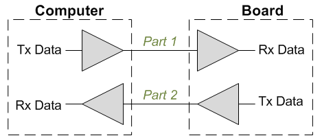
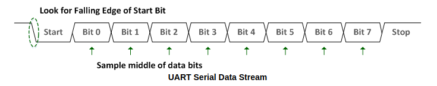

# Part 1: UART receiver

UART is a simple protocol for communication over a wire. Data is received over
one wire and transmitted over another.

Our UART hardware module will consist of a receiver and a transmitter. For the receiver
portion, data is sent to the FPGA from the computer one bit at a time. The receiver
converts each set of 8 serial bits into one byte. This is a conversion of serial data
to parallel data.

The transmitter performs the opposite task: it takes a byte and sends each bit
over the transmit wire to the computer one at a time.

Before a transaction, the transmitter and receiver must agree on a set of parameters.
These are usually manually set beforehand. The parameters are:

* Baud rate: (9600, 19200, 115200, ...). This is number of bits transmitted per second.
* Number of data bits: 8.
* Parity bit: (on, off). Parity bits can be used to check if data was received correctly.
* Stop bits: (0, 1, 2). The number of high bits sent after a byte has been sent.

There are also more advanced configuration parameters. Our UART will be designed for
a baud rate of 19200, 8 data bits, no parity bit, and 1 stop bit. The baud rate
can be easily adjusted, or made dynamically configurable.

# Protocol

The transmitter will hold the wire high while there is no data to be sent. The start
of a byte being sent is indicated by one low bit. Then each bit is sent, starting
with the least significant bit. After the byte, 1 stop bit is transmitted.

The receiver should sample the data value during the middle of each bit cycle
in order to reduce the chance that it samples while the bit is changing. In
order to sample close to the middle, the receiver usually runs a clock at least
8x or 16x faster than the baud rate.

# Task

First, implement a counter that will generate ticks at 16x the baud rate
(19200). You can reuse your counter from last lab, but it should generate a
single-cycle tick when the max value is reached. Our board's clock runs at 48MHz
by default (the `CLK_MHZ` constant is set to 48). This code goes in `counter.sv`.
Also set the max value properly in `uart_top.sv`.

Next write a finite state machine for receiving the data. I recommend using
four states: idle, start, data, stop. Remember that you get 16 ticks per UART
bit, and you should sample the bits as close to the middle as possible (e.g.,
on tick 7). This code goes in `uart_rx.sv`.

`uart_top.sv` connects the counter to your uart module for you, and connects
the received data to the RGB LED.

# Testing

There is a simulator with a built-in test for both the receiver and
transmitter. Run `make sim` to build it and then `./sim` to run. The test will
print the result and some information if it failed. You can also enable the
`DEBUG` variable in `sim.cc` to get additional information from the test. The
test will also generate a `trace.vcd` file when it runs. You can open this file
using GTKwave and view all the signals during the run and how they changed over
time.

Run `make synth` and then `make prog` to program the FPGA. After running `make
prog` you may need to disconnect the UPduino and plug it back in to the port
for the tty to be detected. If you are on Linux, you can try running `make
uart` to do this automatically without needing to physically disconnect the
device.

Then run `screen [tty-port] 19200`. Running `make screen` will automatically
try to open `/dev/ttyUSB0` (feel free to edit the makefile).

Once the connection is open, pressing r/g/b on your keyboard should turn on the
red/green/blue led on the FPGA.

# Part 2: UART transmitter

Now you'll write a transmitter in `uart_tx.sv` the transmitter sends out
a byte on the `tx` serially. The top module is now set up to connect your
receiver from part 1 with the transmitter so that your FPGA will echo back the
data it receives. With everything done correctly, when you run screen you
should be able to type in the window (it sends the byte, and then screen
receives it back and displays it).

The additional code in `flag_buf.sv` is meant to store the most recently
received byte. Without this buffer the transmitter might start transmitting
garbage while the receiver is receiving a byte still in flight.

# Extensions

* Another protocol: implement the protocol for one of the devices we have used
  (light strip, IR emitter/receiver). It should be very similar (state
  machine).
* Multiple UARTs: the FPGA can fit a bunch of UARTs -- maybe you can do
  something interesting with that.
* Currently only one byte is saved in the `flag_buf` before data starts getting
  lost. Implement a FIFO that has a configurable depth so that more data can be
  buffered.

---

Images from: https://www.nandland.com/goboard/uart-go-board-project-part1.html
