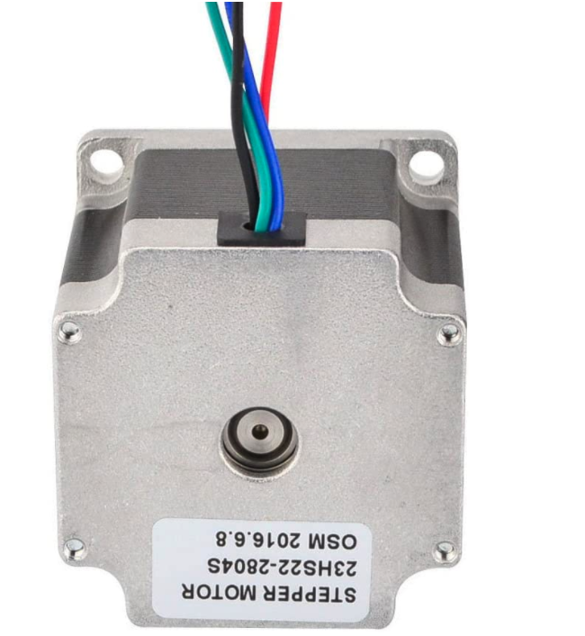
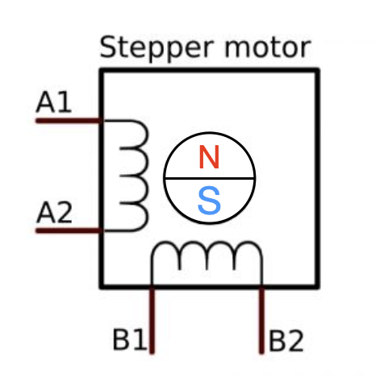
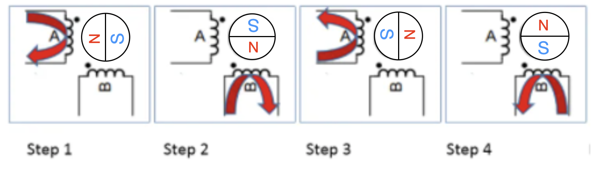
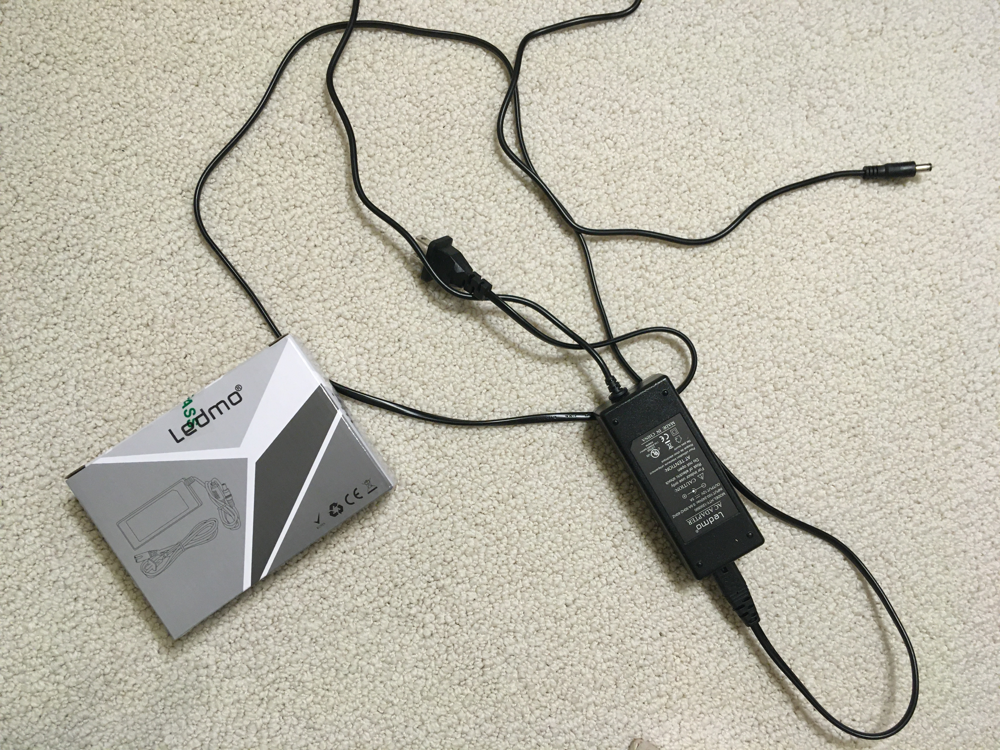
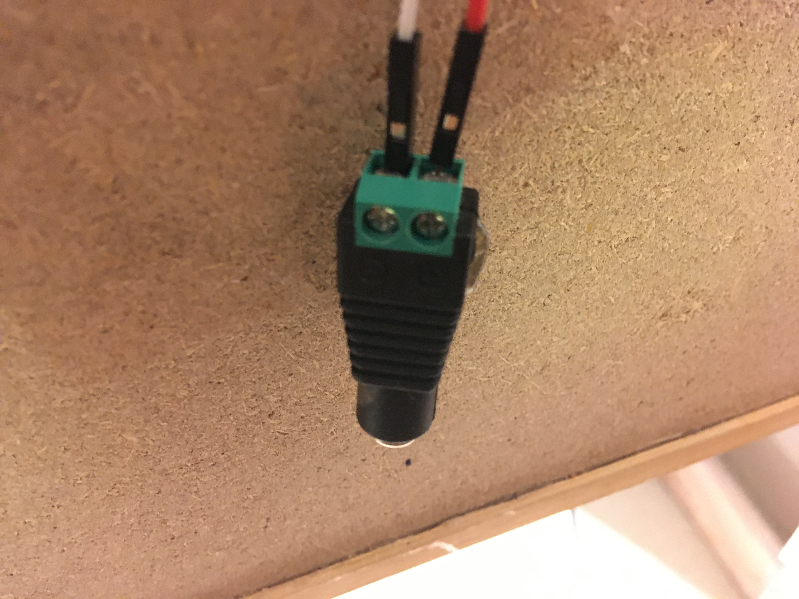
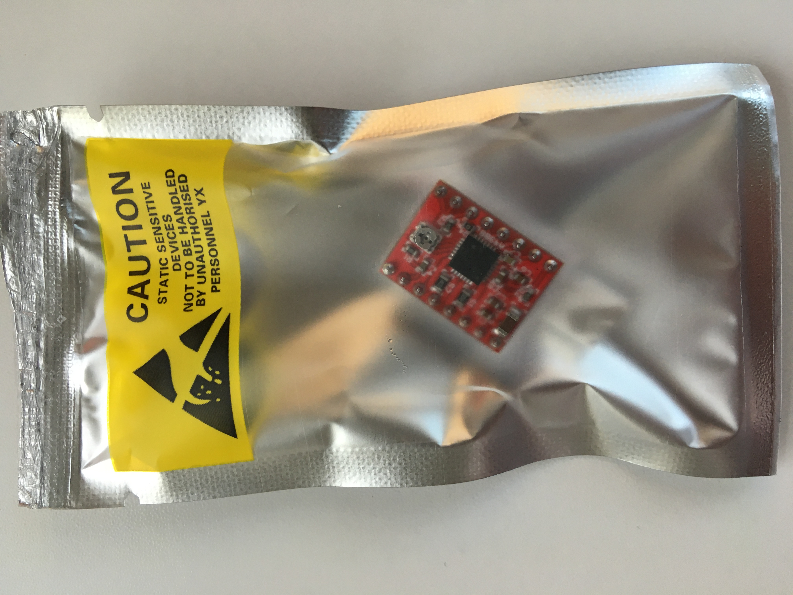
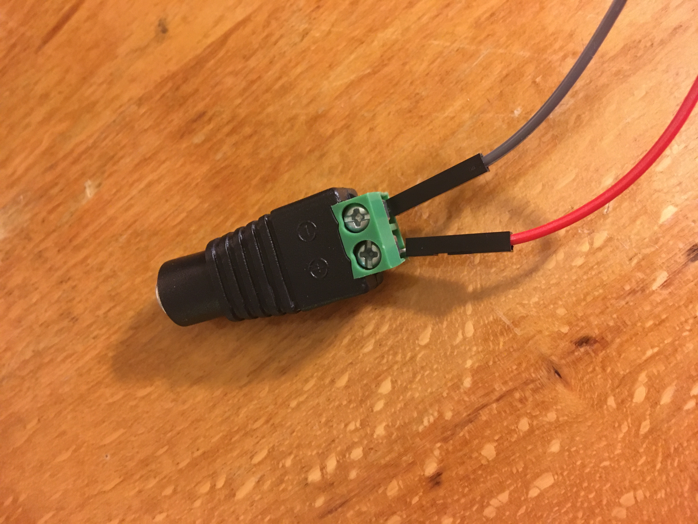

# Prelab

Table of Contents
- [Prelab](#prelab)
  - [Part 0 - Background](#part-0---background)
    - [Motor](#motor)
    - [Driver](#driver)
  - [Part 0.5 - Parts](#part-05---parts)
  - [Part 1 - Wiring Everything Up](#part-1---wiring-everything-up)
  - [Part 2 - Verify](#part-2---verify)

## Part 0 - Background

### Motor
Today we're working with a NEMA 23 stepper motor. NEMA is an association which creates standards. The NEMA 23 standard means that our motor is approximately 2.3 inches wide. The larger the stepper motor, the more torque and more current we need to power it. Our motor has a max torque of 1.26 Nm. Interesting fact: there are NEMA 54 stepper motors out there. These are a lot bigger in person than they look in pictures. These can produce 36 Nm of force.

You might notice that your motor has four wires coming out of it. As you might have guessed, these are how we control our motor.

Internally, these wires are connected up to coils (A1, A2, B1, B2 are our wires) which surround a magnet:

So if we run current from wire A1 towards wire A2, through the coil that connects the two, then we create a magnetic field that may, we'll attract the north end of the magnet towards the coil.

And if we drive current from A2 to A1, in the opposite direction, we'll attract the south end of the magnet towards the coil. 

Similarity, if we run current through the B1/B2 coil, we'll attract / repel the magnet. 

Here's a descriptive image:

As you can see in the above image, if we drive wires A1, A2, A3 and A4 in the right order, we can cause the magnet inside to spin! Furthermore, this internal magnet is connected up to a shaft. So spinning the magnet = spinning the motor.

A cool physics thing that you can try out right now (which idk how works--one of our physics legends can probably explain :)) is if you press the wire ends of the right two wires (find w/ trial and error) and then try to spin the motor shaft, you'll feel some resistance and maybe clicking!

Another cool thing is that you can directly put 12v power into a pair of wires in the stepper. If you choose the right pair, you see/hear a cool (well... "cool") thing. It should be safe to connect any pair of wires to power, but I'm no EE person, so someone (Brian) should definitely verify this. 

Note: Our motor has 200 steps in a full revolution, not 4. Not sure exactly how this is done internally, but maybe the shaft isn't connected to just a single magnet, but instead 50? Idk.

### Driver
So connect up four gpio pins to the four wires coming out of the stepper and we're set, right? Unfortunately, no. Our pins output a max of 16 mA of current at 3.3v which isn't nearly enough for our stepper. Instead, we need external hardware. 

You might imagine that we can hook up some transistors to the Pi and go from there. That's a perfectly valid approach. In fact, a dual h Bridge packages up these transistors up for us into a single easy to use board. However, most cheap dual h bridges that I found weren't rated for high enough current for our stepper, and would get unbearably hot. 

Another way to drive the stepper is to use a dedicated stepper motor driver. In this lab, we'll use the a4988 for this. The a4988 abstracts away a lot of work for us--instead of having to control wires A1/A2 and B1/B2 directly, the a4988 will take care of this. **With the a4988, we just use the DIR and STEP pins. DIR changes the direction of stepping, and STEP steps the motor forward by one step.**

## Part 0.5 - Parts
Here's a list of everything the lab needs, minus stuff like gpio wires:
- Ledmo power supply

- The green adapter

- a4988 stepper driver

- stepper motor
- 

## Part 1 - Wiring Everything Up

This image describes how to wire everything up. Note: ignore the capacitor (weird thing labelled 100 uF)

As a step by step guide, connecting directly to the a4988 (you can also use a breadboard if you want):
1. Put a heat sink on the a4988. This will make everything... *cooler*. (Goes on the black chip that's near the screw; peel the white paper off the flat bottom of the heat sink). 
2. Solder female dupont connector ends to the motor's wires. You may be able to get around this with a breadboard and sticking the wires directly into the breadboard, but I don't recommend that "technique".
3. With your power supply unplugged, Take two male to female jumper wires and stick the male ends into the power supply, then screw them in. 
   
4. With the power supply still unplugged, connect the female ends of the jumper wires to VMOT and the adjacent GND. 
5. Connect RESET and SLEEP together on the a4988 with a female to female jumper
6. Connect a4988's STEP pin to pin 20 on the pi and a4988's DIR pin to pin 21 on the pi.
7. With the Pi off, connect 3v3 and a ground pin to VDD and the adjacent GND on the a4988 respectively
8. Connect the stepper motor's wires to A1/A2/B1/B2 (this is probably actually be 1A/1B/2A/2B--different people might have different labels, but the pairs are next to each other on the driver. Just look at the position of the pins in the diagram and match based off of that).
   1. It does matter which wire goes to which pin, to a certain degree
   2. The key is to find wire "pairings" and then ensure you connect each pair to a pin with the same letter (i.e. if I find that the green and red wire are a pair, then I should connect the green wire to either 1A or 1B and then the red wire to the other).
   3. You can find wire pairings with trial and error. Take any two wires, then touch their metal ends together. While their ends are held together, try spinning the motor shaft. If you feel more resistance than if the wire ends aren't contacted then you've found your pair. Otherwise, try one of the other two possible pairings. 

## Part 2 - Verify
Run `my-install test-programs/stepper_test.bin`. Should see/hear spinning/patriotism. 
