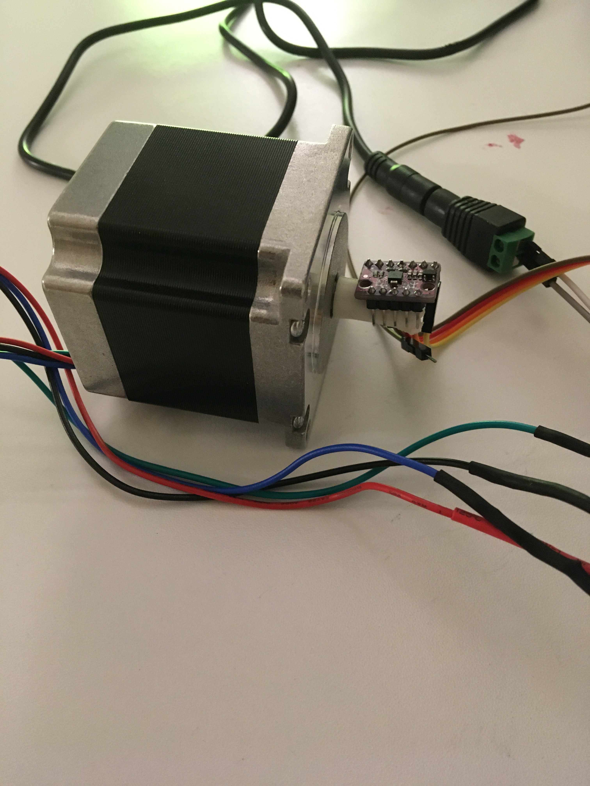
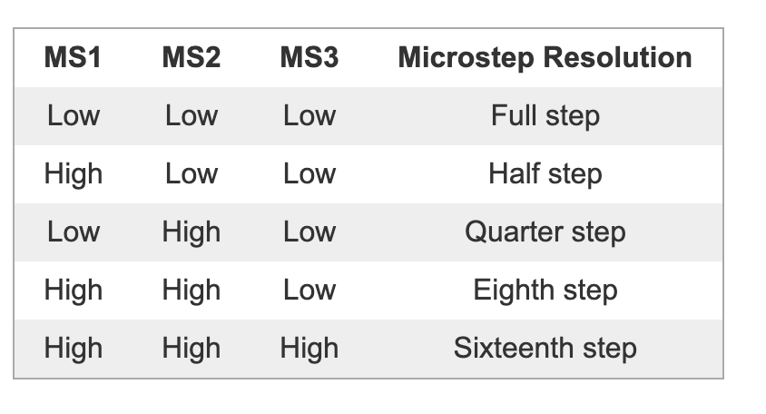

# Stepper Motors

This lab was written by Alex Fu in the first cs340lx.  You'll notice
it has much better discussion :)

First thing: wire up the stepper motor using the [PRELAB](PRELAB.md).


Table of Contents
- [Stepper Motors](#stepper-motors)
  - [Part 1 - Driving the stepper motor](#part-1---driving-the-stepper-motor)
  - [Part 2 - Driving the stepper motor with interrupts](#part-2---driving-the-stepper-motor-with-interrupts)
    - [Interrupt Implementation Ideas](#interrupt-implementation-ideas)
      - [Option 1: raw time based](#option-1-raw-time-based)
      - [Option 2: time quanta based](#option-2-time-quanta-based)
      - [Option 3: raw time based, but better](#option-3-raw-time-based-but-better)
    - [Other interrupt notes](#other-interrupt-notes)
  - [Part 3 - Extensions](#part-3---extensions)
    - [Extension: Accel](#extension-accel)
    - [Extension: Microstepping](#extension-microstepping)
    - [Extension: Acceleration](#extension-acceleration)
    - [Extension: Do something cool](#extension-do-something-cool)


## Part 1 - Driving the stepper motor

This should be pretty easy, assuming everything is wired up correctly. The
idea: all we need to do is write a 0 or a 1 to DIR, depending on which
direction we want to run the motor in, and then we need to write a 1 to
STEP to step.

You can now write a nice interface to step the motor and change
directions. Some starter code that you can modify add to or ignore as
you'd like is provided in `stepper.c`. Also some music data for the
national anthem is provided in `national_anthem.c`. To play it, you'll
have to build your own "play notes" function.

Some general notes:
  - Our motor has 200 steps per full revolution.
  - **To do multiple motor steps, you'll need to write a 0 to STEP
    between any two 1-writes to STEP.**
  - You'll need to delay for some amount of time between any two motor
    steps, otherwise you'll "skip steps." You should find out what the
    min delay time you can have between any two motor steps, before your
    motor begins to skip.
  - Challenge: try to spin the motor as fast as you can! Try adding
    accelerations with well timed delays to get even more speed. This
    is a simple idea, but can become nuanced. Also, note that at small
    time delays, the time you delay between steps isn't the actual time
    between steps, since our step function takes some amount of time.
  - You should keep track of the motor's position (based on the number
    of steps you've stepped it and the direction you stepped it in).
  - It may be fun to write functions which step the motor for a certain
    number of steps, or until it's reached a certain number of steps.
  - You can also write functions to step the motor at a specific speed or
    frequency, and then generate tones from there (you can download a tuner
    app on your phone to find precise frequencies, and then use ratios and
    stuff to extrapolate more notes/pitches from that single, tuned note).
  - Then, play the national anthem, or write/transcrive your own song!

## Part 2 - Driving the stepper motor with interrupts

Telling the motor explicitly to step is annoying. Let's use interrupts so
that we can just tell the stepper to run at a speed or go to a position,
and let the timer interrupts deal with actually stepping the motor!

There are many different ways to do this. You can either come up with
your own, or see some of the options down below for inspiration. Each
of the options listed below have their own downfalls and benefits. Maybe
you can come up with a system that checks more boxes!

The starter code has some code that implements option 1, which is the
simplest option in my opinion.

### Interrupt Implementation Ideas

The ideas which I will list follow this spec: we can enqueue a goal
position and a speed into a queue, and the interrupt based stepper will
go to these positions at the specified speeds. There's other ways to do
this, which you should explore if you've got ideas!

Each of the ideas I'll list have several things in common: 

1. There is a `stepper_int_t` struct, which contains data for a specific stepper, including a queue of `stepper_position_t`'s. 
   ```c
   typedef struct {
     stepper_t stepper,
     stepper_status_t status
     Q_t positions_Q
   } stepper_int_t
   ```
1. There is a `stepper_position_t` type which contains data about a specific position for the stepper to go to. The layout these depends on which option you choose, and are defined down in each option's description.
2. We'll define a couple enums to make life cleaner (you can change these, and it's likely you won't need all of the options):
   ```c
   typedef enum  {
     IN_JOB,
     NOT_IN_JOB
   } stepper_status_t;

   typedef enum {
     NOT_STARTED,
     STARTED,
     FINISHED,
     ERROR
   } stepper_position_status_t;
   ```

#### Option 1: raw time based

The idea behind this is that we keep track of the current time, and
the time at the previous step, and if it's been a sufficient amount
of time, we step again and then update the time at the previous
step. More specifically, keep track of the desired time between each
step `usec_between_steps` and the time that the last step occurred
`usec_at_prev_step` and then if `current_time > usec_at_prev_step +
usec_between_steps` then we step and update `usec_at_prev_step`. Here's
how our structs might look like

```c
typedef struct stepper_position_t {
  struct stepper_position_t * next; // needed, as described in  "Q.h"
  int goal_steps,
  unsigned usec_between_steps,
  unsigned usec_at_prev_step,
  stepper_position_status_t status
} stepper_position_t; 
```

Benefits: simple, should be easy to add in accelerations (try adding in
a `time_at_prev_prev_step` or, equivalently, a `velocity` field to the
stepper struct)

Drawbacks: Missing steps cascades, we don't have precise control of
speed--it's limited to the granularity of our timer interrupts. Timer
overflow--what to do in this scenario?

#### Option 2: time quanta based

The idea behind this one is that we set our interrupt handler to trigger
every `N` usecs. So we can put a label to that `N` usec period of time,
and use that as an abstraction. We'll call it a time "quanta". Here's
how our position struct might look like:

```c
typedef struct stepper_position_t {
  struct stepper_position_t * next;
  int goal_steps,
  unsigned quanta_between_steps,
  stepper_position_status_t status
} stepper_position_t; 
```

We also have a global variable `quanta_count` which we increment every
time the interrupt handler fires. In the interrupt handler, peek the head
of the `positions_Q` and if `quanta_count % quanta_between_steps == 0`,
then we step. The direction in which we step depends on `goal_steps` and
our current position. If current position equals `goal_steps` then pop
off the current position. Also, update statuses of stepper and position
as necessary.

Benefits: We're not going to "miss" steps in software, like we will in
option 1. This is kind of not really a benefit because the way we prevent
the missing of steps is essentially by preventing the user from choosing
speeds which will cause missed steps, since users can only choose speeds
which are multiples of the quanta size.

Drawbacks: just like option 1, the granularity of our stepper speeds is
limited by the time between interrupt handler fires. It's also a littler
slower/more complicated than option 1. It's also hard to incorporate
accelerations into this, I think.

#### Option 3: raw time based, but better

This is my favorite option of the three, because it doesn't have the
cascading missed steps problem of option 1 and allows for precise speed
control (from my testing, regardless of what speed you choose or how
long you run the stepper for, this method will have a job completion
time within 100 usec of the expected job completion time.)

Here's what our positions struct could look like: 
```c
typedef struct stepper_position_t {
  struct stepper3_position_t * next;
  int start_steps; // starting steps of this position
  int goal_steps; // goal steps of this position
  unsigned start_time_usec; // start time of the position
  unsigned usec_between_steps;
  stepper_position_status_t status;
} stepper_position_t;
```

The logic for this option is in the interrupt handler, we get the
current position of the stepper, and then get the expected current
position at the current time we are at (I defined a helper routine to do
that math--`static int get_expected_curr_pos(stepper_position_t * goal,
unsigned curr_time, int curr_pos);`. Note: be attentive to signs). Then,
`diff = expected_curr_pos - curr_pos`, and we step for `diff` amount of
steps in the handler.

The primary reason this method is so much better than option 1 is
because we're keeping track of the `start_time_usec` and not just the
`usec_at_prev_step` which means things stay more in sync.

Note that for every position, the first time we see it, initialize
`start_steps` and `start_time_usec` to the current steps and the
current time.

Benefits: Good precision in speed, and no software-missed steps.

Drawbacks: it may be the case that we skip steps mechanically since
we might do multiple fast steps (`diff > 1`) in the interrupt handler
at once. We could delay between these steps, but that draws out the
interrupt handler, which is not good (although `diff > 1` should be very
rare since most of the time, especially if your interrupt handler triggers
pretty frequently, as our stepper shouldn't be able to go that fast).

### Other interrupt notes
- You may find a fast division / mod function useful. Some are provided (implemented with binary long division).
- You can look into extending this library to multiple steppers. Also, consider adding a 'sync' state to ensure that multiple steppers are synced up. 
- You should add in temporary time checks to see how long your interrupt handler takes to run. Obviously, try to keep this as short as possible, although this time shouldn't be a limiting factor for the speed at which you can step your motor (without any physics trickery i.e. adding acceleration, even with 16 microsteps, my stepper maxes out at ~100 usec per microstep. Without microsteps, this rises up to like 1600 usec. Plenty of time).
- You can allow user to select the start time in option 3. 

## Part 3 - Extensions
Steppers are cool by themselves, but can be a lot cooler in combination with other things. Rephrased: steppers are so cool that they can make other, maybe boring, things cool. Note: some of these extensions need you to attach hardware to the motor's shaft. I used double sided tape for this, and hot glue might also work, but this can be difficult, so if you can't, just do one of the other extensions.

### Extension: Accel
Make a 1D gimbal with your accel. If I'm not mistaken, the accel measures forces that the chip feels. And since gravity is, well, gravity, we can use it as a reference point for determining orientation. So if we put things together like this:

 

Then we can program a self-balancing rig. My code is pretty simple:
1. I read from the accel to get a "zero" reference point
2. I begin a loop where I check the accel reading, compare it to the reference point, and then step in the appropriate direction to correct any movements. 
3. Then I delay for ~40ms, because when the stepper is stepping (and for a little time afterwards) our accel's readings aren't what we want, since there are other forces besides gravity now acting on our stepper. 
This way of doing things isn't the greatest, because there's a decent amount of lag in the position correcting, since we're not stepping fast enough due to the added delay (40ms between steps & 200 steps per rotation => 8 seconds per rev, very slow). Try to figure out something better than I did!

### Extension: Microstepping
This one is very easy and pretty nice. Read up on how a4988 does microstepping (or look at image below). Makes your stepper a lot quieter and smoother. One challenge is that you lose speed, since your steps sizes are smaller (everything will be N times slower if you do N microsteps). You can counteract this by allowing your interrupt handler to trigger N times more often than it previously did.



You might also notice that we ony get 1/16th microsteps with this driver. Though that allows for pretty smooth control, theoretically we can get way better. Some drivers give 1/256 microsteps. (I think) we can "simulate" microsteps in software. The idea is that in a short period of time, we switch between stepping forwards and backwards very quickly. And if we're faster than the time it takes for the motor to complete a step, then the motor will hang in the middle, "between" steps. You can use this to get 1/2th microsteps and I think 1/32 microsteps if you set the hardware to already be in 1/16th microsteps. I think you can also use timings to get 1/Nth microsteps (if I step forwards for 75% of the time and backwards for 25% of the time, then I'll be in a 3/4ths step position?), but no clue if this is legit. 

### Extension: Acceleration
Implement accelerations (with interrupts if you're up to a challenge: I recommend using either option 1 or option 3 of the additional options sections of the interrupt part of this lab). How fast can you get your stepper to run? Recommendations for highest speed: use your smallest microstepping option, use delay_ncycles for finer granularity. Also, be careful because the time which you delay between steps isn't exactly equal to the psychical time between steps, since our step function takes time. My fastest speed (on a nema 17 motor--haven't tested with the nema 23) was 8 usec (physical time, not delay time) per 16th step, or 2343 rpm. As a comparison, with neither accelerations nor microstepping, my best rpm on that same motor was 336 rpm. For the nema 23: rpm 457 vs 10 rpm. Maybe you can do better! (Note: another cool thing about steppers, *I think*, is that regardless of how fast they're spinning, they consume the same amount of power. It's very likely that I'm wrong, but based on steppers work, that's my impression). 

### Extension: Do something cool
Ideas:
- We have three hall effect sensors and a magnet--maybe you could build a basic encoder and use this in addition to running the motor at a fast speed over a long amount of time to check if / how many steps the motor skips?
- sonar taped to shaft, to create point cloud map of your room. The resolution of your map is related to the size of your motor's steps/microsteps, and the amount of patience you have to generate a map.
- Something with accelerometer. For example, have a laser pointer point in whatever direction you orient the accelerometer in. Alternatively, have laser pointer point in same direction no matter how you rotate the body of the stepper with your hand. Also: maybe replace laser pointer with your device of choice. 
- The light strip. Do something cool. 
- Use the fact that we can generate tones with the stepper. Perhaps encode a secret message in the tones you generate, and see if we can decode it over zoom's audio and microphones connected to our Pi's.
- Courtesy of Akshay, We've seen what the unix kernel *looks like*, now: what does it sound like? 
- Use your computer mouse to control stepper somehow?
- Make your keyboard a *keyboard* piano. If you hold down a key, the stepper plays a note. If you lift a key, the stepper stops playing the note. How do deal with the situation where multiple keys are pressed?
- You can probably come up with things cooler--do that if you have something!!
