# PCB (KiCAD) Lab by Parthiv

This lab is focused on designing printed circuit boards (PCBs), which you may find useful in your final project. This is moreso a quick lesson on how to replace your bundles of wires with a more reliable board, rather than how to actually design electrical circuits on a board which is a much more involved discussion. 

Our goal is to create a board that can plug into the Raspberry Pi GPIO header and connect to the USB/UART converter and 2 NRFs. You can also optionally add other devices to the board of your choosing. My board looks something like this:

You can see the GPIO header on the bottom and various headers on the top to connect other devices.

A sample PCB project that contains the board above can be found in `parthiv_pcb/`. You can refer to this if you ever run into a wall for how to proceed.

## Step 0: Installation

Please follow the instructions at [https://www.kicad.org/download/](https://www.kicad.org/download/) for your OS. It is open source so it should be possible but potentially annoying to build if your OS isn't listed.

### General Keyboard Shortcuts
I assume `Ctrl` becomes `Cmd` on mac.

* `Ctrl+S`: Save (do often!)
* `Ctrl+Z`: Undo
* `Ctrl+Y`: Redo
## Step 1: Creating a Project

1. Open up KiCAD (either type `kicad` in your terminal or search for it in your installed applications).
2. Go to File->New Project. Select a location where you want to create the project (you can do it in this directory) and give it a name. Ensure that the box to "Create a new folder for the project" is selected. Create the project.
3. You should see a window like this:

    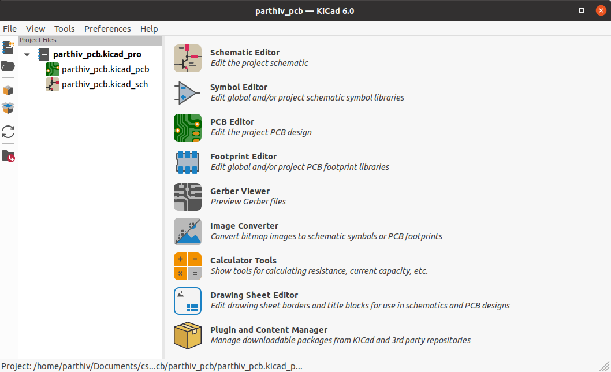

    On the left side, you can see a file called [project_name].kicad_pcb and another file called [project_name].kicad_sch. Double clicking these will open the PCB and Schematic editors respectively. 

## Step 2: Creating your Schematic

1. In the main KiCAD window, double click the .kicad_sch file to open the Schematic editor. You will see a blank schematic:

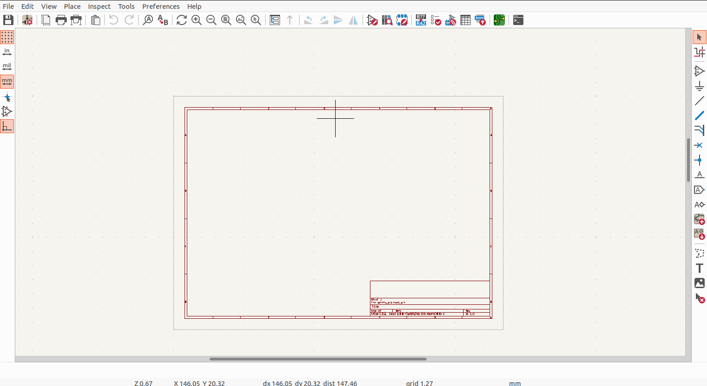

The schematic is where we will describe what pins of what components connect to what other pins of other components. You should try to keep it relatively organized if you can!

You can middle click and drag to move, or scroll up/down to zoom.

2. Go to Place->Add Symbol (or type the keyboard shortcut `A`). In the search bar, search for the symbol `Raspberry_Pi_2_3`. Select it, then click OK to start placing the component. Place it somewhere in the middle of the schematic by clicking. If you want to move it, you can click on it, hit `M`, and then move it around, then click again to place it. 

3. Now, we will connect the power rails of the Raspberry Pi. Hit `P` to open up the power symbol menu. Look for `GND` and hit OK to start placing the ground symbol. Put it near the bottom of the Raspberry Pi symbol. Hover over the end of one of the GND pins on the Pi, then hit `W` to start drawing a wire. Connect it to the GND symbol you just placed. Repeat this process for all the GND pins (see below).

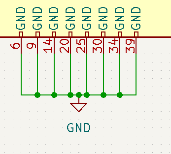

Next, add power symbols for `+5V` and `+3V3` to the schematic, and connect those to the 5V and 3V3 pins of the Pi. Make sure you connect all pins of a given type together. We say 3V3 instead of 3.3V because in small text on a PCB, it may look like 33V. 3V3 is unambiguous.

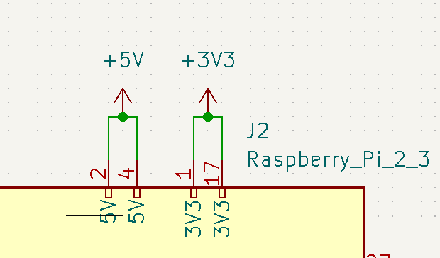

4. Now that we've connected the power for the Pi, let's add some more components. Hit `A` again and find the `NRF24L01_Breakout` component, then place two of them. I would recommend putting them to the right of the Pi. Go ahead and connect the VCC to +3V3 and GND to GND.

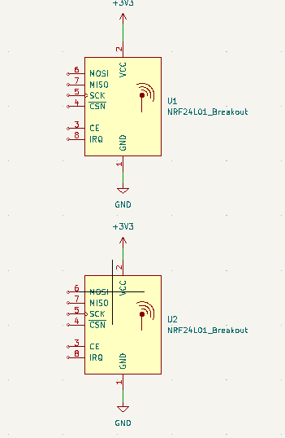

5. Now, connect the NRF I/O pins to the Pi. For both NRFs, connect MOSI/MISO/SCK to the MOSI0/MISO0/SCK0 pins on the Pi. Also, connect the CSN of one to the Pi's CE0, and the CSN of the other to the Pi's CE1. Finally, connect the CE of each to two free GPIO pins (I chose 5 and 6). You can optionally also connect the IRQ pins to GPIO pins so you could have interrupt functionality, just make sure that each IRQ goes to a different GPIO.

6. The next step is to add a 10 uF coupling capacitor to each of the NRF power input pins to help smooth out the power supply to the NRF. Hit `A` and look for the `C_Polarized` part, and place one by each NRF. Connect the positive end of each to the NRF VCC, and the negative end to ground. Click on each capacitor and hit `E` to edit the properties. Set the value of each capacitor to `10 uF`. See the screenshot at the end of this section for what it should look like when you're done. 

7. Now, let's create a connector for our USB/UART chip so we can plug it directly into the PCB. We'll want to create a symbol to represent the logical pins that the USB/UART has. Go to Tools->Symbol Editor. You will see a blank symbol editor like this:

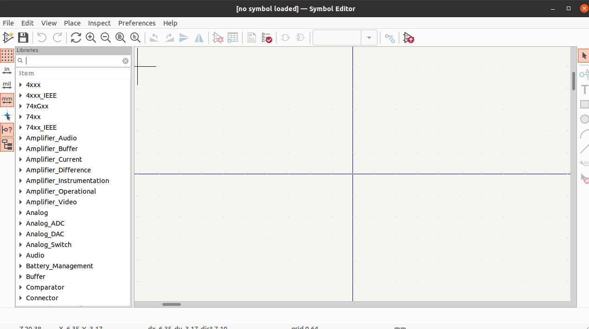

On the left, you can see various symbol libraries which contain different default parts that are common enough to be included in KiCAD. We will be creating a new one.

8. In the symbol editor, go to File->New Library. If you make it Project, any parts you make will only be usable in the current project. If you make it Global, you can use it in future projects. I went with Project but either is ok. Give it whatever name you want (`cs340lx_pcb`, or something)

9. On the left window, find the library you just created and right click on it. Then click New Symbol, and you'll see a window pop up. See below for recommended settings.

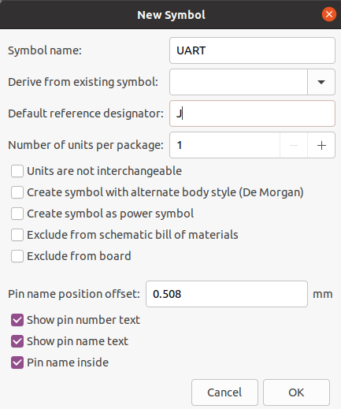

Click on OK and create it. 

10. On the very left (past the list of libraries), right click on the grid and select Grid Properties. 

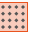

In the window that shows up, change Current Grid to 2.54mm. This will prevent the weird alignment issues we had during lab.

11. On the right side, select the Draw a Rectangle tool and draw a rectangle on the screen. Don't worry, you can change it later. If you want to move the auto-generated text (`UART` and `J`), you can click on it (press escape to reach select mode like in the schematic editor) and hit `M` to move it. Click to place.

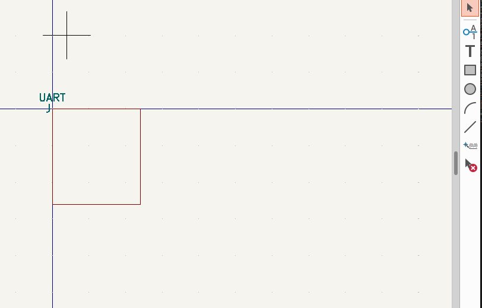

12. Now, we will add the pins. Hit `P` to create a pin. We'll make the `GND` pin, which is pin number 4 (4th from the top of the UART) and is a Power Output.

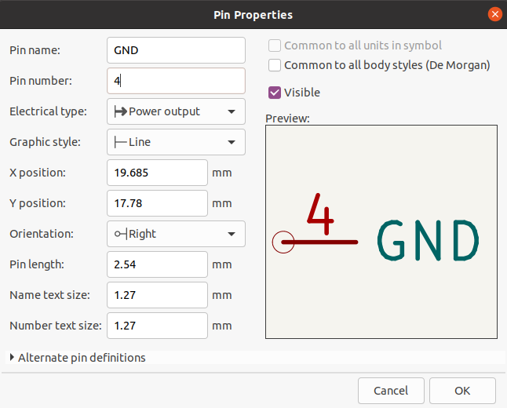

Place the pin down at the bottom of the rectangle, ensuring that the circle end of the pin is facing out (this is where you'll connect wires in the schematic).

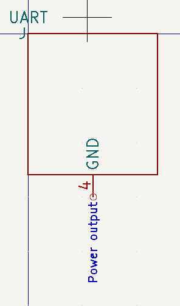

13. Create the remaining 4 pins:

- 1: 3V3, power output
- 2: TX, output
- 3: RX, input
- 4: GND, power output (already did in step 11)
- 5: 5V, power output

Try to keep voltage at the top, ground at the bottom, and signals on the sides (like the Raspberry Pi symbol). You can grow and shrink the rectangle if needed by going to the select tool (escape). Your symbol should look something like this (doesn't have to match exactly). You can rotate a pin with `R` and move with `M` like you'd expect.

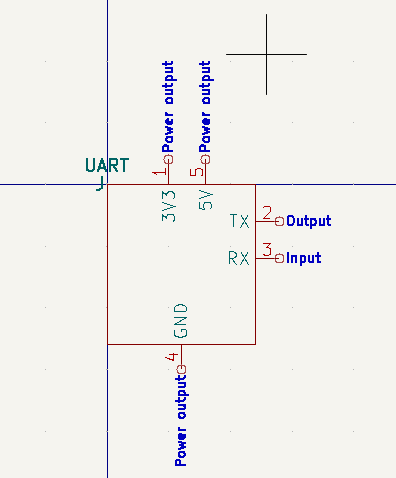

14. Once you've finished the UART symbol, save with Ctrl-S or Command-S, then exit the symbol editor. In the schematic editor, click `A` to add a symbol. Search for the UART you just created; you should see it pop up.

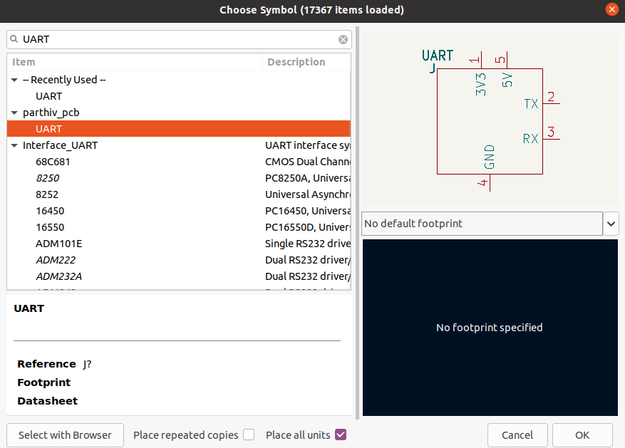

Connect the 5V pin to your +5V rail, GND to GND, TX to the Pi RX and RX to the Pi TX. You can optionally connect 3V3 to +3V3, but this isn't strictly necessary since the Pi also creates its own 3V3 on the pins.

15. Hover over an unused pin on the Pi and hit `Q` to mark it as a No-Connect (looks like an X). This declares that you meant to not connect this pin and didn't just forget to connect it. Now, you're in no-connect placing mode and you can click on all the unused pins on the Pi/UART/NRFs. Compare your schematic against the Completed Schematic section below, making sure that everything is connected the way it should be.

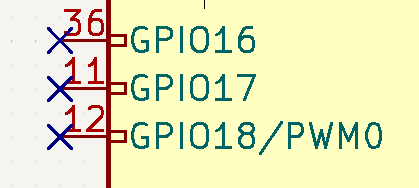

16. At this point, you are almost ready to edit the PCB. Here is the easiest point to go ahead and add more parts to your schematic; for example, if you want to add more sensors/devices. Make sure that when you create symbols, you assign pin numbers correctly so that it makes later steps easier.

17. Annotate the schematic with `Tools->Annotate Schematic`. A window will pop up, click Annotate, which assigns reference designators (`C1`, `J2`, etc) to all the symbols. 

18. Now, go to `Inspect->Electrical Rules Checker` and click Run ERC to run the ERC. Make sure you annotate the schematic first (step 17); otherwise, you get a ton of weird errors. This is like the compiler in software; it will catch violations of electrical rules (syntax) but NOT correctness. And sometimes it gets things wrong, which you will see.

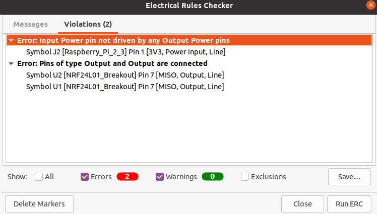

You will hopefully see 2-3 errors. If you connected the UART 3V3 to +3V3, you will not get the first error I have. This error is because whoever made the Raspberry Pi Symbol decided to make the 3V3 pin a power input even though it's a power output. So the ERC thinks nobody is providing power to +3V3. We know this to be wrong (the Pi outputs 3V3) so we can ignore this.

The other error, saying that two outputs (both MISOs) are connected, can also be ignored. It is true that both NRFs output to their MISO pins, but semantically we know that only one will be doing so at a time (when its CSN is low).

If you have other errors, address them and re-run ERC. A common error is forgetting to put a no-connect on a pin in step 15.

19. The last step is to assign footprints, which are the representation of each symbol in the real world PCB. Go to `Tools->Assign Footprints`, which will open a new window. 

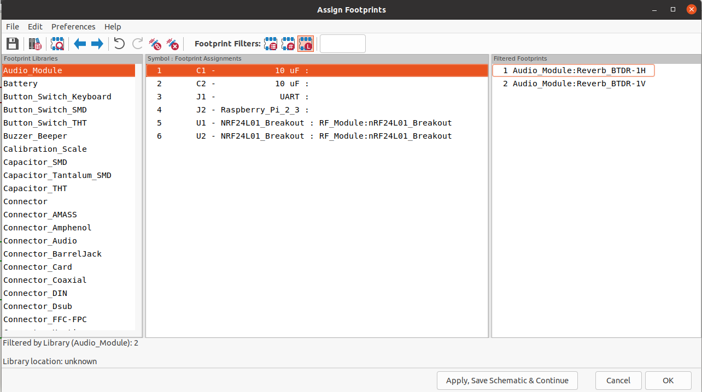

You will see that 2 of the 6 components (the NRFs) have footprints already assigned. We need to assign footprints for the other 4. Click on the row with C1, then on the left side look for library `Capacitor_SMD` (capacitor, surface mount device). On the right side, look for footprint `Capacitor_SMD:CP_Elec_4x5.4`. This corresponds to a capacitor with diameter 4mm and length 5.4mm, which is the size of [this 10uF capacitor](https://jlcpcb.com/partdetail/HonorElec-RVT1E100M0405/C3343) from the manufacturer we will use to assemble our boards (JLCPCB). Double click on `Capacitor_SMD:CP_Elec_4x5.4`, which will assign that footprint to our capacitor.

20. Go through and do this for all the components:

- Both capacitors: `Capacitor_SMD:CP_Elec_4x5.4`
- Pi: Library `Connector_PinSocket_2.54mm`, footprint `Connector_PinSocket_2.54mm:PinSocket_2x20_P2.54mm_Vertical` (0.1" female header, 2x20)
- UART: Library `Connector_PinSocket_2.54mm`, footprint `Connector_PinSocket_2.54mm:PinSocket_1x05_P2.54mm_Horizontal` (0.1" female 90 degree heder, 1x5).

Make sure it matches below. 

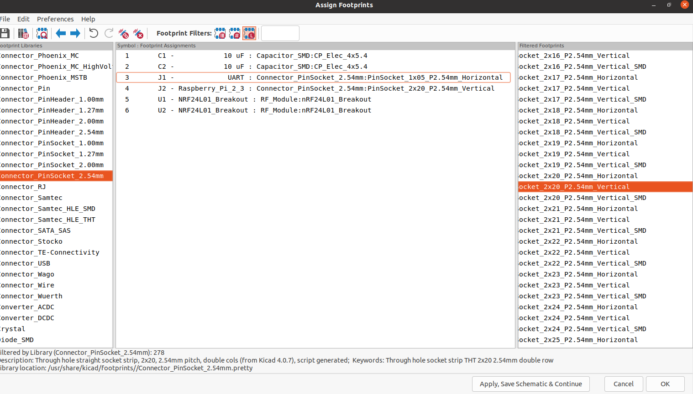

Then click "Apply, Save Schematic & Continue". You can then close out of the Assign Footprints window and the schematic editor.

### Completed Schematic

When you're done, your schematic should look something like this:

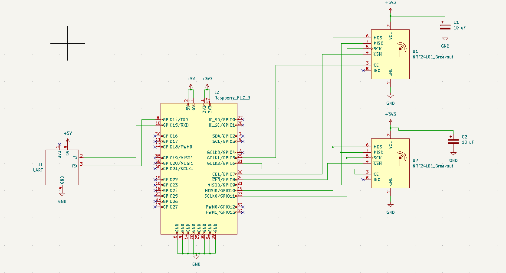

### Schematic Editor Keyboard Shortcuts

* `A`: add symbol
* `P`: add power symbol
* `Esc`: go to regular mouse (select) mode
* `M`: move (after selecting a symbol)
* `R`: rotate (after selecting a symbol)
* `E`: edit symbol properties (after selecting a symbol)
* `Q`: place no-connect symbol (should be in select mode first)
* `W`: draw wire (should be in select mode first)

### Schematic Editor Tools

* Tools->Symbol Editor: create new symbols
* Tools->Annotate Schematic: assign reference designators
* Tools->Assign Footprints: assign PCB footprints to schematic symbols
* Inspect->Electrical Rules Checker: validate against some rules

### Footprint Editor Keyboard Shortcuts

* `P`: add pin
* `Esc`: go to regular mouse (select) mode
* `M`: move (after selecting a symbol)
* `R`: rotate (after selecting a symbol)

## Step 2: Create PCB

Now, the fun begins -- time to create the PCB. For all of these steps, you don't have to match the exact thing I do. Actually better if you don't, so it's your board and not you making my board :D

1. From the KiCAD main window, double click the .kicad_pcb file to open the PCB editor. You will see a blank PCB, this time a black background instead of white (schematic).

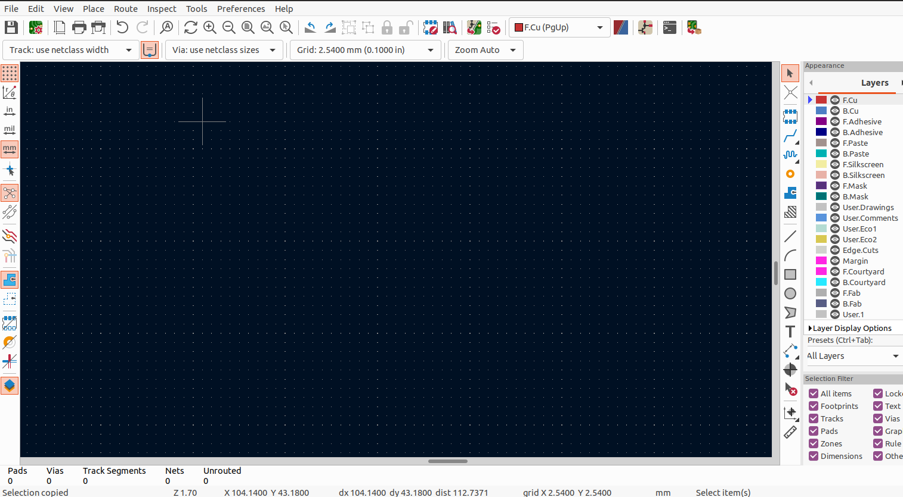

You can middle click and drag to move, or scroll up/down to zoom.

2. Go to Tools->Update PCB From Schematic. This will open a window, click "Update PCB". Hopefully, there are zero warnings/errors. 

A common error is forgetting to assign a footprint to a symbol in the schematic. If you do this, then KiCAD is unsure what physical footprint to assign to the logical symbol you created in the schematic. Revisit step 19 from part 1 if this happens. Then, come back to the PCB viewer and this step again.

If you have zero warnings/errors, then you can "Close" the window that popped up, and then click anywhere to place the mess of components.

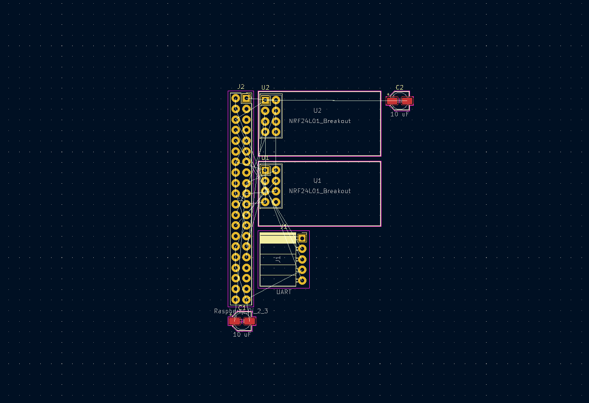

You will see a 2x20 pin header for the Pi, 1x5 header for the UART, two 2x4 headers for the NRFs, and two capacitors.

3. If you look at the picture at the very top of this page, you will see that the Pi header is on the underside of the board whereas everything else is on the top. To move the Pi connector to the backside of the board, click on it, then hit `F` to "flip" it to the back. You will see the outline change from pink to blue, and also the text related to the Pi header will be mirrored. 

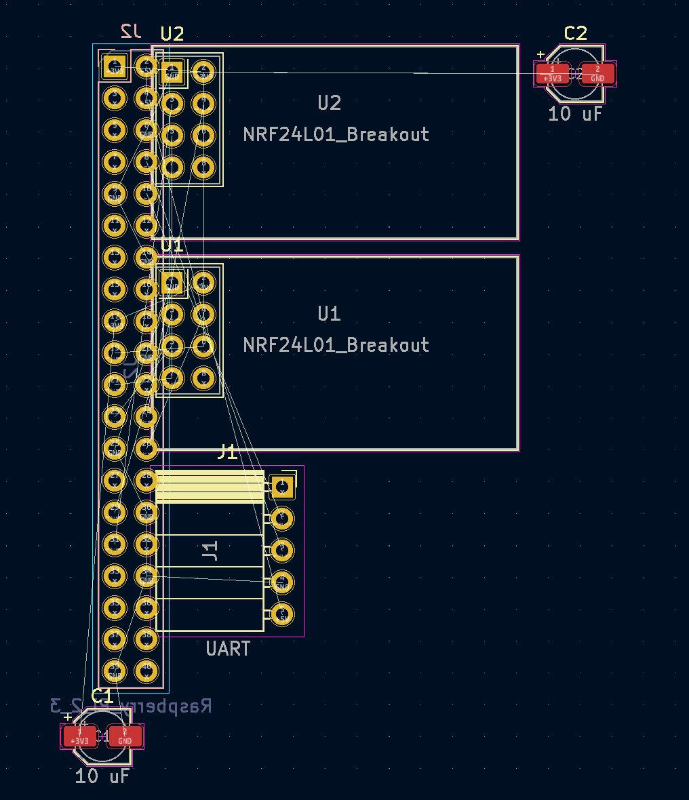

You can also go to View->3D viewer to see this, though there will probably be an error about not having a board outline yet (which we will fix soon).

4. Now, we will try to organize the components reasonably well to minimize the length of the connections we need to make. Hit `Esc` to go to select mode, then click on any footprint. Once you've selected the footprint, you can rotate it with `R` or move it with `M`. Click to place when you're in move mode. 

All of the thin white lines you see connecting the different pins of components are connections we will eventually need to make, so trying to keep these as "untangled" as possible will make things easier. That being said, it's probably impossible to completely avoid crossing (it's not an issue to have crossing wires as we have two layers).

I would recommend putting the Pi header at the top of the other components, with the +5V pads to the left. Then, put the UART near the left side of the Pi header (so there's a short path for +5V).

Also, make sure to keep each capacitor close to the +3V3 pad of one of the NRFs. Technically, the way that our schematic is, we could connect them to anywhere on +3V3 and GND. However, we would like to keep the resistance on the path between the capacitor and the NRF as small as possible, so that the capacitor can deliver power to the NRF when it has current spikes during transmit. Here's one possible arrangement which is pretty reasonable:

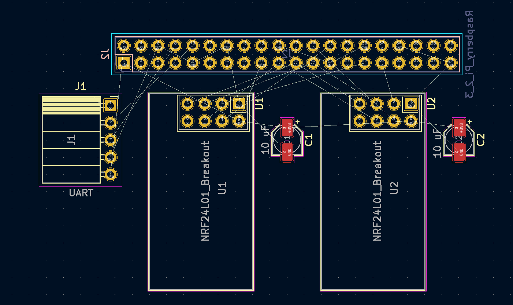

In lab I also told people you can put the capacitors "underneath" the NRFs. Since the NRF is quite high off the board with its header, and the capacitors are short, you can go for that if you'd like as it'd help save board space.

5. Let's draw the outline for our board. On the right side, you will see a bunch of Layers

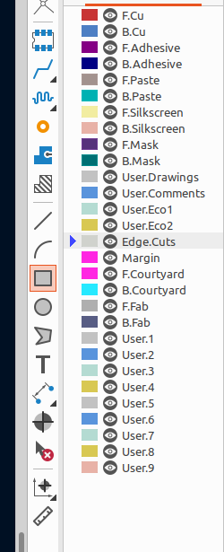

These each represent a different layer of the PCB. Some highlights:
* `F` and `B` prefixes are for front and back, as we can have many things on either side of the board
* `Cu`: front and back copper, which are where we make our connections
* `Adhesive`: some components are glued to the board, this layer shows where the glue should be placed
* `Paste`: for surface-mount components, this is where the machine will automatically place solder paste. After components are automatically placed in their locations, the whole board is baked, melting the solder paste, then cooled, hardening the paste (and making electrical/mechanical connection with the components).
* `Silkscreen`: text/drawings that are printed on the board for aesthetic/documentation reasons
* `Mask`: The green (or other color) layer of the board which protects the underlying copper from corrosion and accidental shorts. It's expected that most of the board has mask, so the `Mask` layer is actually the negative. So it shows where there is _not_ mask.
* `User.*`: these don't get printed, so you can put stuff for documentation
* `Edge.Cuts`: the edges of the board which are cut.
* `Courtyard`: bounding polygons for the various components. Ideally, no courtyards overlap so we can ensure that no components are inside each other. Just like we had an ERC in schematic, we have a DRC (design rules check) for the PCB which will complain if two courtyards overlap. However sometimes we know that we are safe (e.g. capacitor fits "under" NRF).

You can enable/disable the visibility of layers by clicking the eye icon, which can be interesting. 

You'll want to click on the `Edge.Cuts` layer and make sure the triangle is pointing to it (like in the image above). Select the rectangle tool (also selected in the image above). Now, draw a rectangle around the components you made by clicking once for one corner, then clicking again for the opposite corner. Give your self some extra space for routing traces (wires) around the components. 

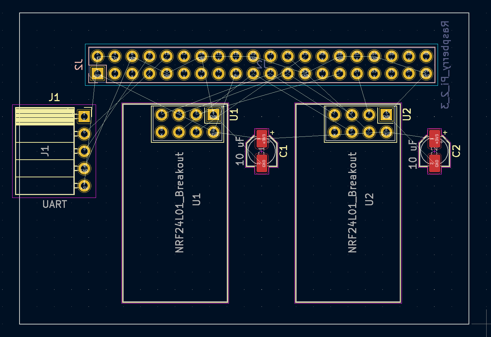

Now, if you open Tools->3D Viewer, you will see your new outline.

If you make it too big/too small, you can always edit this by clicking on the `Edge.Cuts` layer, then the select tool (`Esc`), then clicking on the corner of the rectangle and changing the shape. 

You can also make a custom shape using a vector graphics tool like inkscape, then export as SVG. Then go to File->Import->Graphics and add your shape to the `Edge.Cuts` layer.

6. A common practice in PCB design is to make (almost) the entire front of the board be connected to your power rail, and (almost) the entire back of the board be connected to your ground rail (or vice versa). This helps you avoid having to manually connect every power and ground together, sort of like how we just connected them to the GND and +3V3 symbols on the schematic to avoid a ratsnest of wires between the power pins.

We will do that now. Click on the `F.Cu` layer and do `Ctrl+Shift+Z` (mac may be `Cmd` instead of `Ctrl`) to open a window for "copper zone". Ensure that the `F.Cu` layer is selected on the left, then select the `+3V3` net.

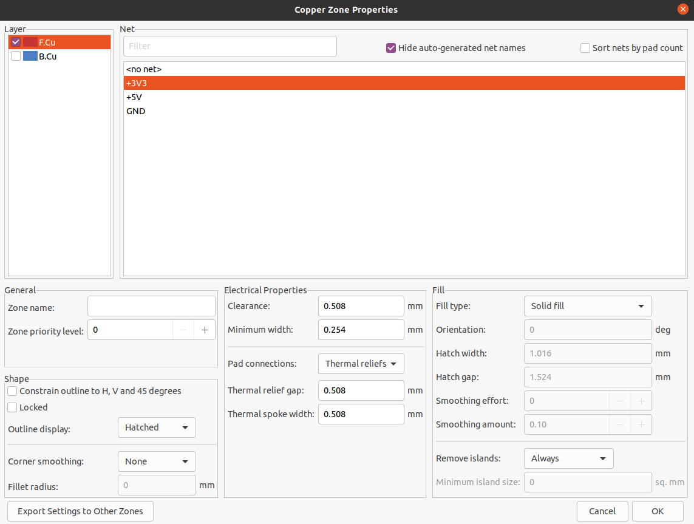

Hit OK, then draw a rectangle that's bigger than the rectangle you drew for the edge cuts (this time, you need to click all 4 corners, not just 2 opposite). Repeat the process for `B.Cu` and `GND`. It should look something like this when you're done:

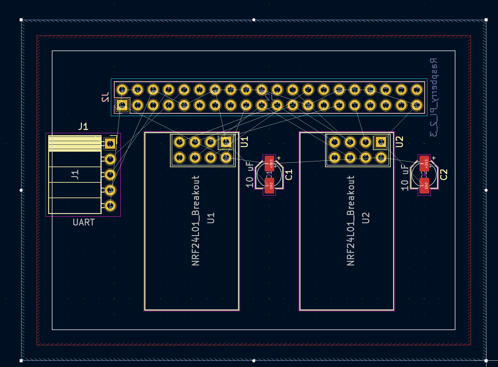

If you mess up while you're drawing, you can hit `Esc` and try again.

7. Let's actually fill the zones to make the electrical connections. Hit `B` to fill zones. This should hopefully connect almost all of our +3V3 and GND connections for us! You'll see the white connection lines for those disappear. If you zoom in to some pins, you will see what exactly happened:

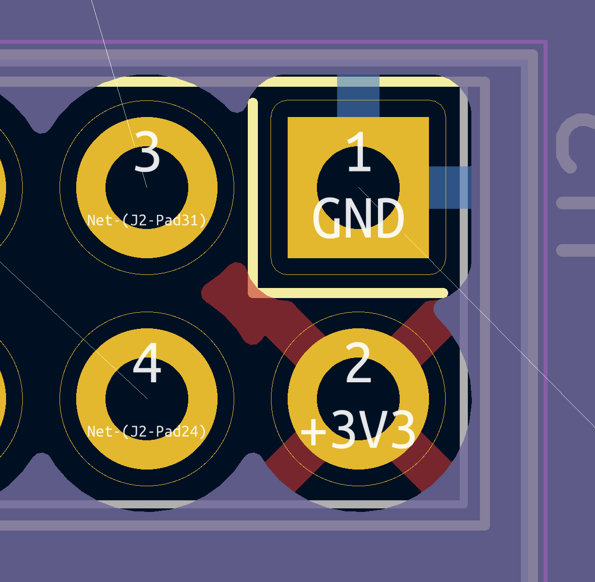

Notice that on the front side (red), where we made the 3V3 zone, KiCAD helpfully connected the pin with an X pattern. On the back side (blue), where we made the GND zone, KiCAD connected with a + pattern. it may be easier to see what's going on if you make one of the two copper layers invisible (see step 5). Make sure to turn it back on afterwards.

8. Let's setup the schematic editor to be ready to route the traces (wires) we use to make electrical connections. Go to the top-left corner, where it says `Track: use netclass width`. Click this and do `Edit predefined sizes`. Add widths of `0.25 mm` and `1 mm`. 

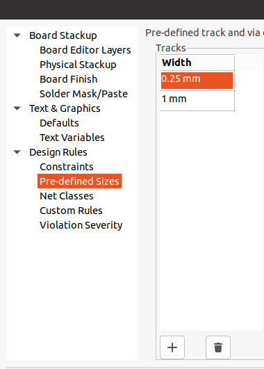

Hit OK. On the top left under `Track: use netclass width`, you can now select those two sizes. We will use `1 mm` tracks for power and `0.25 mm` for signals. Wider tracks have lower resistance (good for high current) but are harder to route. 

9. Now the fun begins: time to route our traces! Click on `F.Cu` on the left to route on the front of the board. Then, select a `1 mm` trace width. Move your mouse over the +5V pad on the UART (you can zoom with scroll wheel, and middle click+drag to pan). Hit `X` to enter trace mode. If you move your mouse, you will see a trace expanding out of the pad.

Each time you click in trace mode, you will "save" some of your progress that you've made. Once you reach your target, you can click on it to finish routing the trace. In general, try to avoid 90 degree turns. 

Go ahead and connect the 5V from the UART to both Pi 5V pins. Then, hit `B` to re-fill the zones, and you'll see a bit of the 3V3 zone has been cleared out to allow the trace you just made to go through it. Make sure you give a bit of clearance from the 3V3 pad of the Pi so that you don't cut it off from the 3V3 plane.

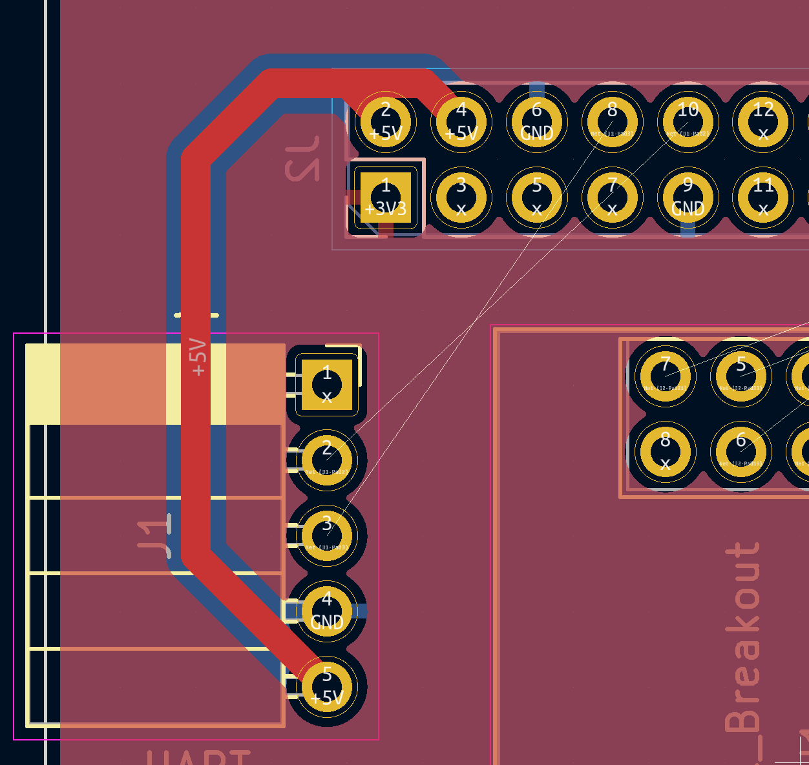

Make sure your trace is similarly THICC as mine, as otherwise it will get very warm due to lots of current! The whole Pi's power comes through this trace. 

10. Let's now route the other 2 UART connections. You can click the `B.Cu` or just hit `V` to swap to the back layer (the board should look blue instead of red).

I routed the first signal as below. I would recommend changing the Grid at the top of the screen to 0.05 inches instead of the default 0.1 inches.

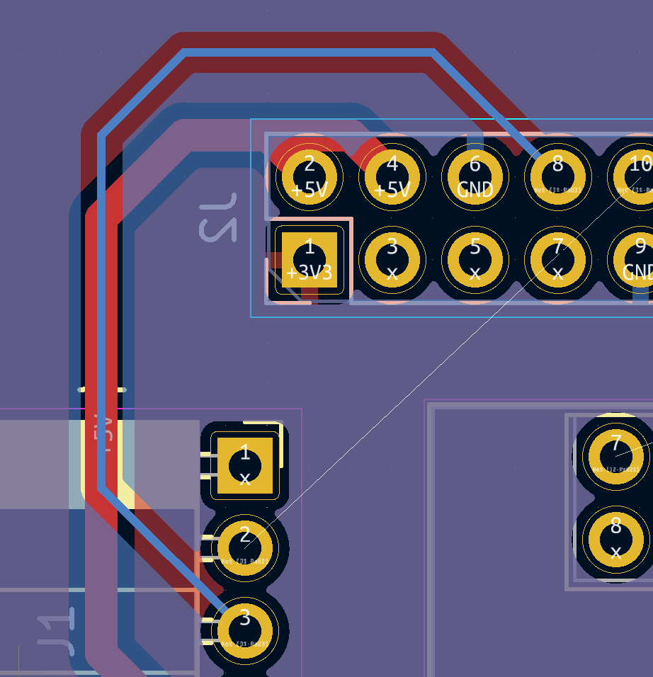

I started routing the second signal, but oh no! The wires have to cross. I hid the F.Cu layer for ease of visibility of what's going on.

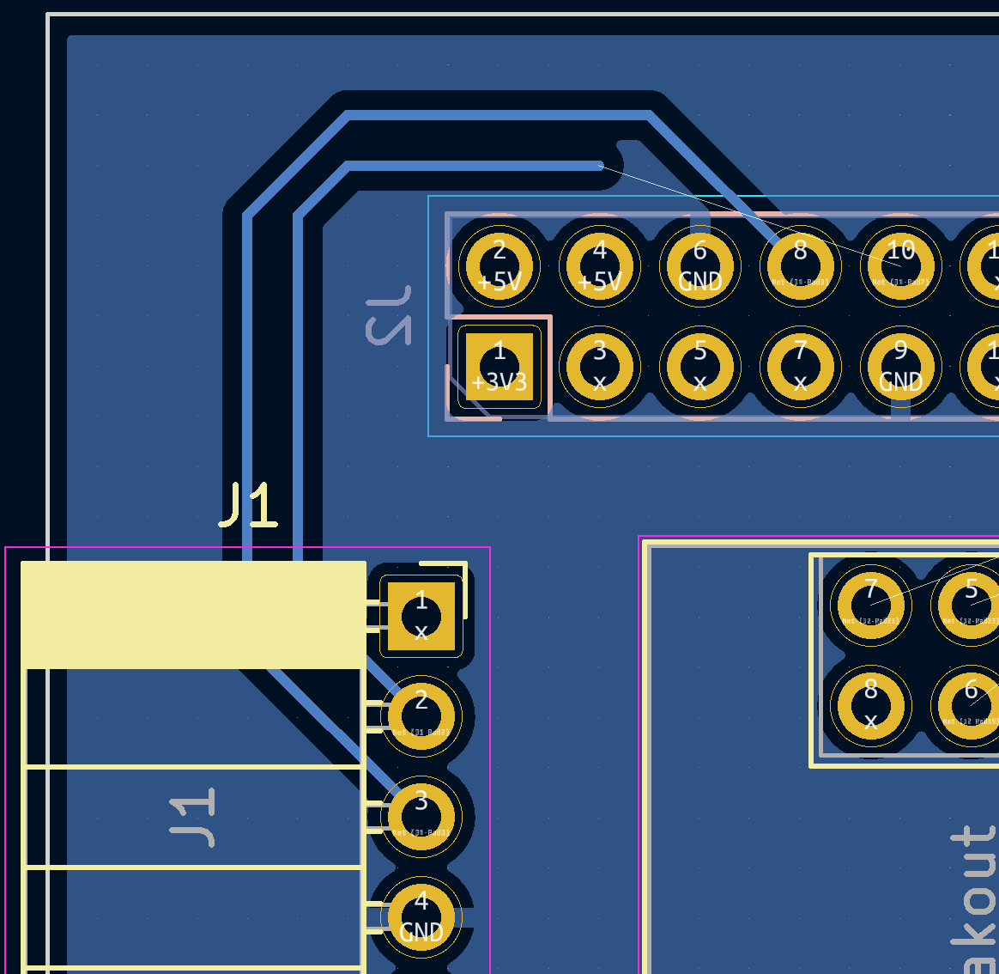

Well, we have two layers! We could, for example, bring the signal to the front of the board and have it cross the other one there. We first need to create a "via", which is a hole used to route the signal between the two layers. Hit `Ctrl+Shift+V` (mac may be `Cmd` instead of `Ctrl`) to go to via mode, then click on the end of the track to place the via there. 

Make sure that you are not putting the via into another trace on the other side of the board. If you need to move your trace, you can enter select mode with `Esc`, make sure that you are on the correct layer (either click on right side or hit `V` to swap layers), then click the trace, then hit `Del` to delete it. Then, you can hit `X` again after mousing over the start of wherever you'd like to re-route from. Make sure you select the right trace size first :)

Now, you can flip over to the other side of the board (click on the right, or `V`) and then hit `X` while hovering over the via to continue routing from the via. 

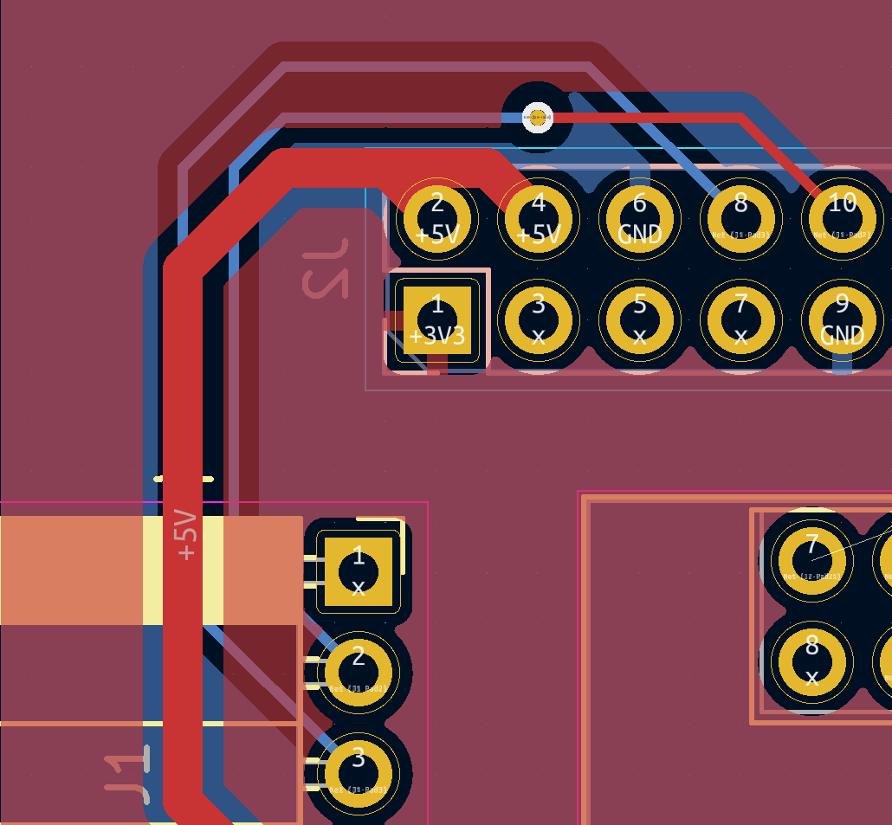

You can examine the result in 3D viewer as well. I'd recommend religiously clicking B after you route traces/create vias to make sure that what the zones are doing makes sense.

As was discussed in lab, it's also possible to smartly route the traces in between the Pi's pins, thereby avoiding the whole via thing. But this is helpful to show now as the routing becomes much more complicated for the SPI signals on the NRF.

11. We want to go and connect the capacitor ground pads to the backside ground plane. Since the capacitors are surface mount components, they have pads on only the frontside. Compare this with the through hole pins on everything else, which can be connected to both the front and back. 

What can we use to connect back/front? Yep, vias! You can see I also moved my capacitors from before to try and make the path from cap->NRF as short as possible. 

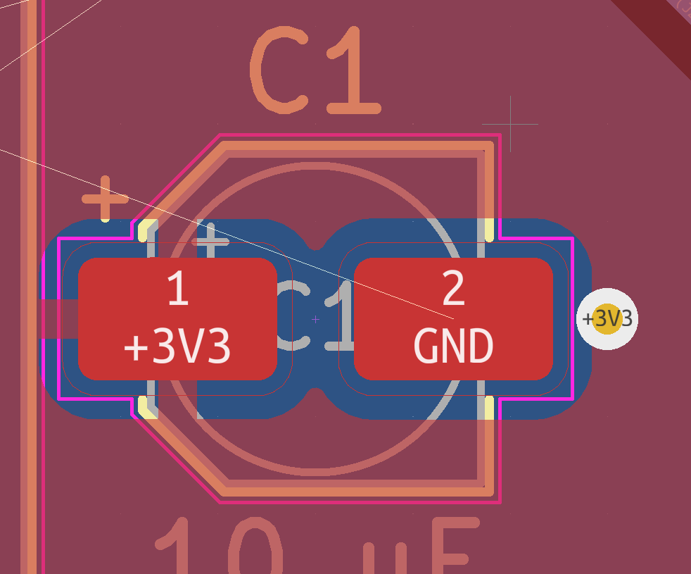

But you may see that the vias were automatically assigned to the 3V3 net instead of GND (maybe not for you, but it was for me). If this happens, you can just go to select mode (`Esc`), then select the via, then hit `E` to edit properties, then change the net to `GND` instead of `+3V3`. Do this for each via, and you should see that the capacitor missing connection from the GND pin now connects to the via instead of the NRF ground pin. I'd also recommend making an actual trace from the capacitor to the 3V3, so that the connection is a bit wider than the little connection that is auto-created.

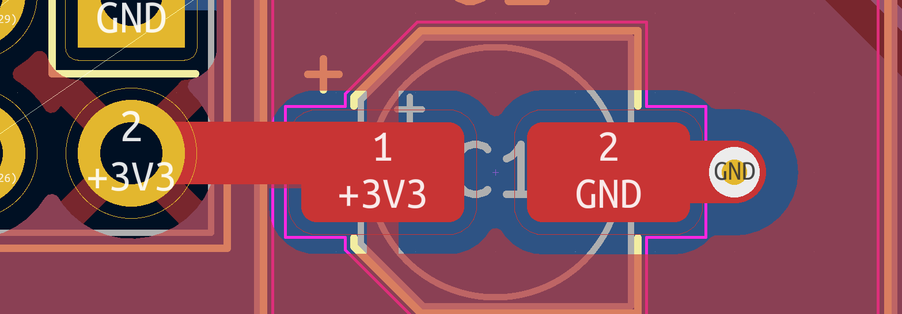

12. OK! Now it's time for you to go and route the rest of the traces as needed. Go ahead and switch the trace width to 0.25mm. Make sure you address every one of the white lines (they should all disappear by the time you're done). This is more of an art than a science, and you will get better as you practice. See the Routing Tips section below for some ideas.

Here is my finished routing (you can also see the `parthiv_pcb/` folder for my project). 

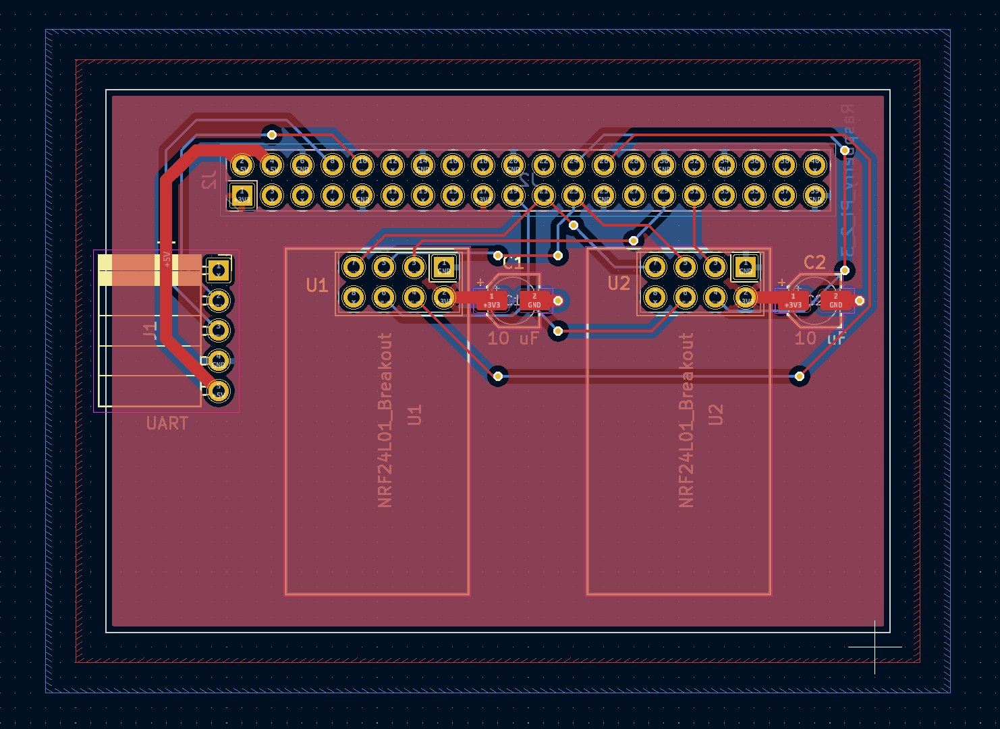

13. Now, let's add some text to our silkscreen so we can remember what is going on on our board. First, open Tools->3D Viewer to see what is already on there.

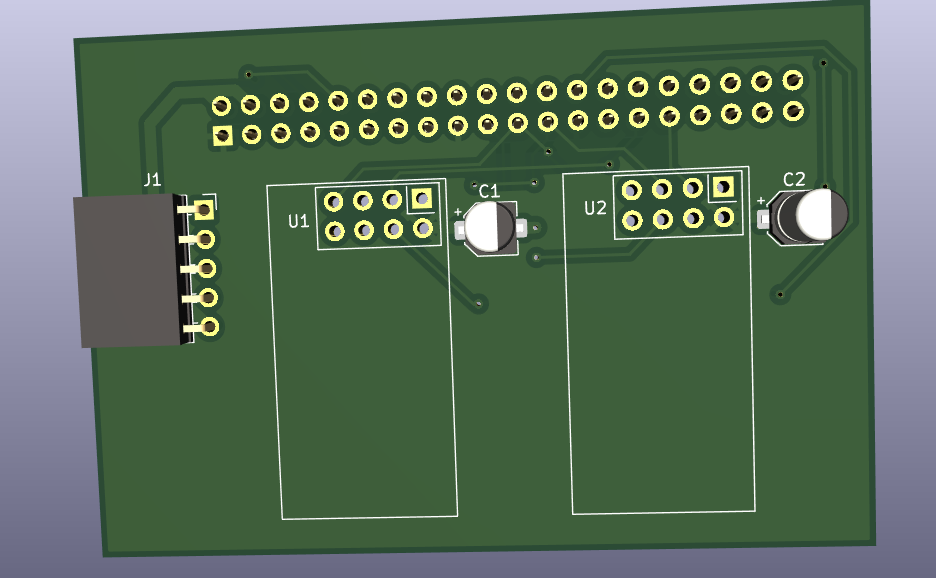

This is ok, since we can at least correlate vs. our schematic with the same reference designators. But perhaps you'd like to add more. If you select `F.Silkscreen` on the right side, you can then go to the Text tool (`Ctrl+Shift+T`) and add text. Click to open a menu where you can type text.

Some helpful things to consider: UART pins so you know what orientation to put it. Maybe also NRF pins so you can remember what's connected to what. Also put your name on it somewhere!

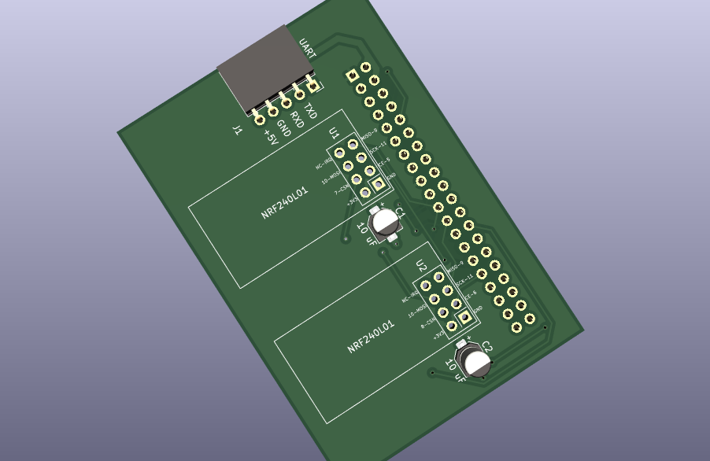

14. Almost done with the board! Let's run DRC (design rules checker) which will make sure our board is manufacturable. Go to Inspect->Design Rules Checker. In the window that pops up, enable "Test for parity between PCB and schematic" just to be sure.

Click Run DRC. If you have errors, go to the DRC Errors section below for common errors. For each, I'd recommend you zoom in super close, then click the entry in the DRC window. You will see an arrow in the middle of your screen. Address the issue and then click Run DRC in the window again. If there are other errors send a screenshot to me (parthiv at stanford) and I can help you out. Eventually, you will get a clean DRC.

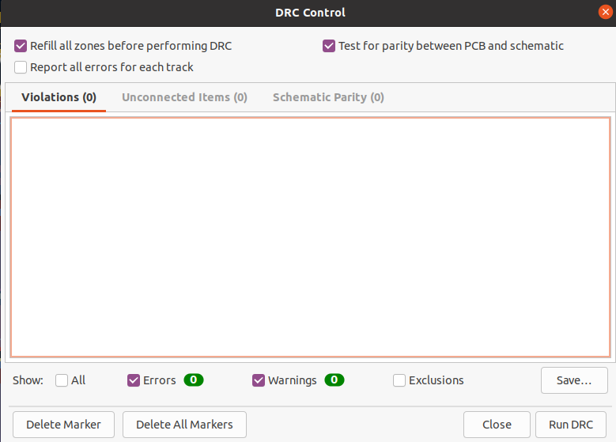

### Routing Tips

#### Clearance
Try to give clearance to pads and don't route traces too close to them (especially ones that connect to planes). This makes it easier in the future to route signals from those pads.

#### Try, try, try again

Don't be afraid to delete an old trace and re-route it if you find you need to move it to make something else work.

#### Zone Islands
An extremely common issue that people ran into was creating a filled zone "island", like below: 

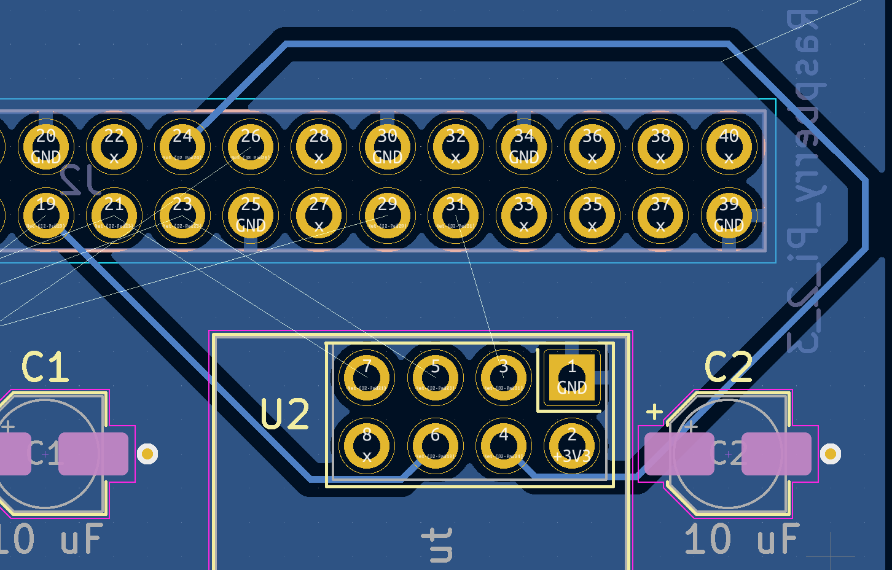 

Notice how the two traces have created an almost closed-loop, which cuts off a section of the filled zone into an island that's disconnected from the rest. An easy fix is to open the closed loop by moving one or more of the segments of the traces onto the other layer. If you go to the select mode (`Esc`), then click on a piece of trace, then hit `E`, then swap the layer to the other layer. You can then go and place vias (`Ctrl+Shift+V`, or `Cmd+Shift+V` for mac?) on each end of the segment that you flipped to the other side to make electrical connection.

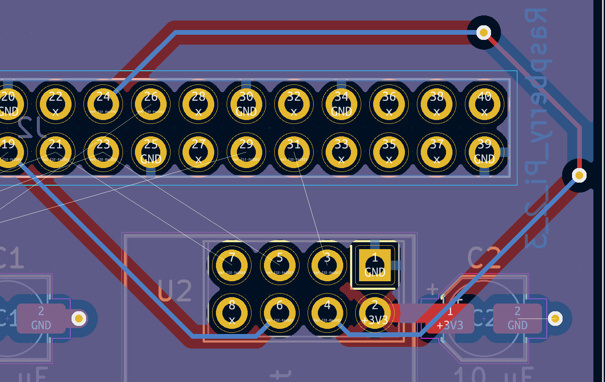

Another (worse) solution is to to put a via on the island and off the island and route a "jump" on the other side of the board. This isn't really recommended though, since it means there is higher resistance on the power plane (vias introduce resistance).

### DRC Errors

Here are some common DRC errors/warnings

#### Track has unconnected end

You have some track that is only connected on one side and can just be deleted. A tricky one is when the track is contained entirely inside a pad hole, so it's invisible (see below). Just click on the exact tip of the arrow that is pointing out the error and it should get highlighted. Then just hit `Del`. It helps to be VERY zoomed in on the PCB editor window.

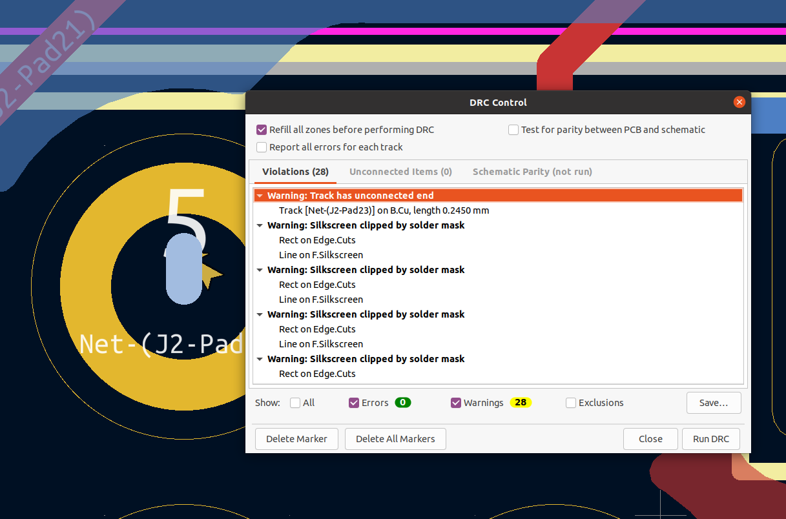

#### Silkscreen clipped by solder mask

You have silkscreen that is either drawn off the edge of the board, or overlaps a pad somehow. Either expand your board (go to `Edge.Cuts` layer, then `Esc` to select, then click and expand the rectangle). Or move the silkscreen item (go to appropriate `*.Silkscreen` layer, then `Esc` to select, then click item, then `M` to move it). Below you can see I drew my board too small so the silkscreen hangs off the edge.

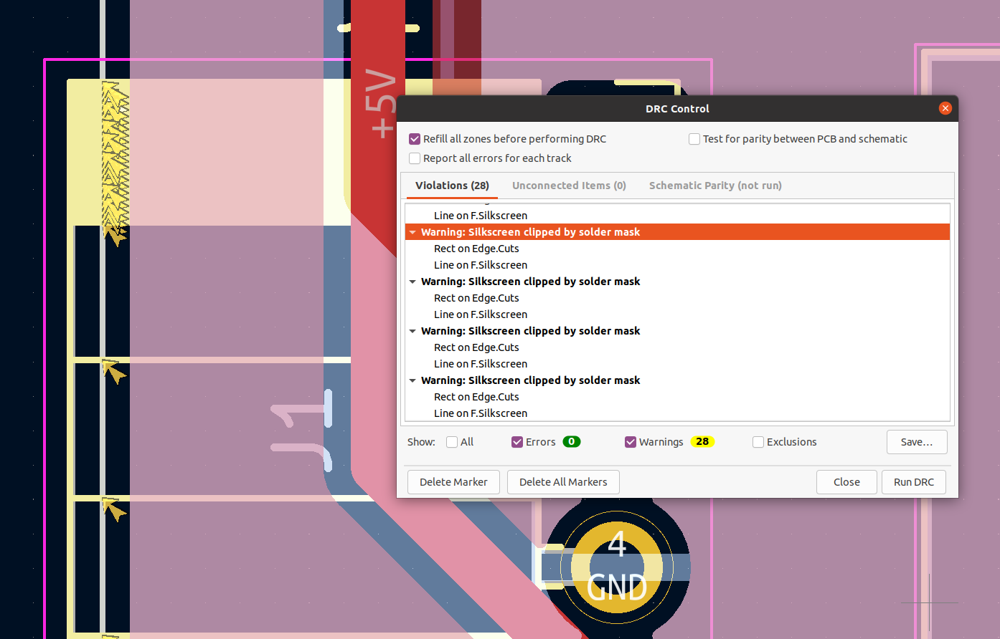

### PCB Editor Keyboard Shortcuts
* `Esc`: go to regular mouse (select) mode
* `M`: move (after selecting a footprint)
* `R`: rotate (after selecting a footprint)
* `F`: flip footprint (after selecting a footprint)
* `Ctrl+Shift+Z` (or `Cmd+Shift+Z` on Mac?): create filled zone
* `B`: fill zones
* `X`: route trace
* `V`: swap active copper layer (front to back or vice versa)
* `Ctrl+Shift+V` (or `Cmd+Shift+V` on Mac?): create via
* `E`: edit properties
* `Ctrl+Shift+T` (or `Cmd+Shift+T` on Mac?): add text (in silkscreen layer)

### PCB Editor Tools
* Tools->Update PCB From Schematic: Apply any updates from the schematic editor (make sure to save in schematic editor)
* View-3D Viewer: view a 3D model of your board
* Inspect->Design Rules Checker: validate that it's manufacturable

## Step 3: Manufacture with JLCPCB

We are ready now to manufacture the board! [JLCPCB](https://jlcpcb.com) is an inexpensive PCB house that also has parts/assembly, so we'll be using them. 

1. Install [this KiCAD plugin](https://github.com/Bouni/kicad-jlcpcb-tools) that helps us generate the files that JLCPCB needs. Follow the instructions there for installation (either method is ok, git clone is probably easier). Then restart KiCAD.

2. In the PCB Editor, go to to Tools->External Plugins->JLCPCB Tools. You will see a window with the 6 parts on our board.

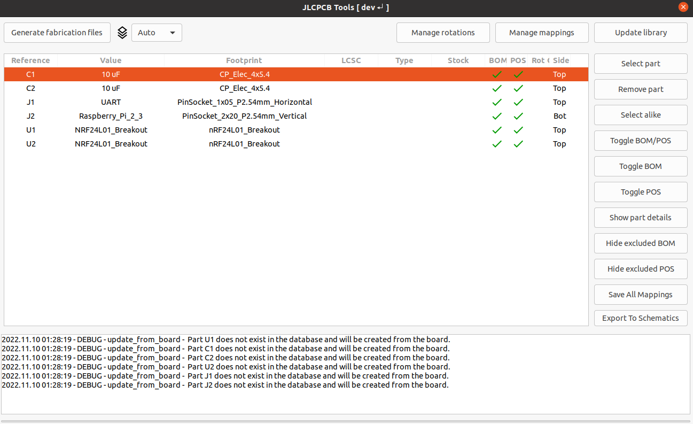

3. We are only having JLCPCB assemble the surface mount parts (just the capacitors in this case). So go ahead and highlight the other 4 non-capacitor parts (shift-click to select multiple), and click the `Toggle BOM/POS` button so that they have Xs next to them. This will exclude those parts from the files we upload to tell JLCPCB how to assemble the board, since we will assemble the pin headers by hand.

3. Click the `Update library` button to download the JLCPCB parts library. This takes a bit ~30-60 secs depending on your internet.

4. Highlight the 2 capacitors (shift-click to select multiple). Then click the `Select part` button. Recall from earlier we chose [this 10uF capacitor](https://jlcpcb.com/partdetail/HonorElec-RVT1E100M0405/C3343). Therefore, in the window that pops up, search for keyword `C3343` (the JLCPCB part number for that component). Highlight the top result (verify it's correct) then hit `Select part`.

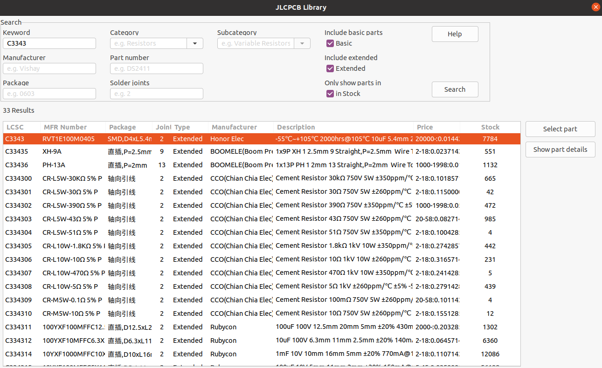

5. Verify that your BOM (bill of materials) looks like this

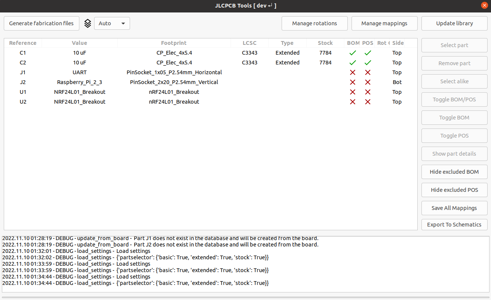

Then, click `Generate fabrication files` in the top right. In your project directory, you should now see a `jlcpcb` subdirectory containing `assembly` and `gerber` subdirectories. 

6. Navigate to [jlcpcb.com](https://jlcpcb.com), then click "Order now" in the top right. 

7. Click on "Add gerber file", then upload `<project_directory>/jlcpcb/gerber/GERBER-<project_name>.zip` (make sure it's the zip, not an individual gerber file). You should see your board in the website!

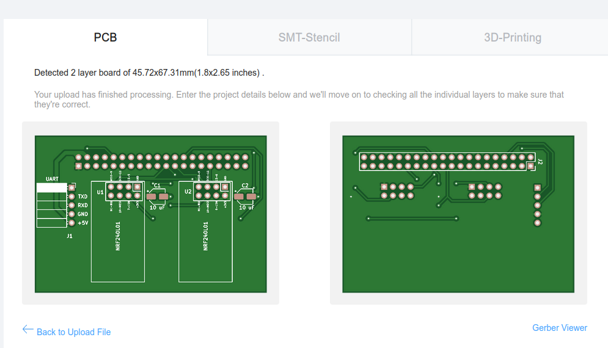

Note, the capacitors won't be there yet (this is just the board).

8. Go through the options. Most things can stay as the default, but perhaps you want to change the PCB color! Non green is the same price but takes a bit longer. Most likely, it is only $2 for the boards unless you made something super big or start messing with the options.

9. Keep scrolling, and "turn on" the slider next to PCB Assembly.

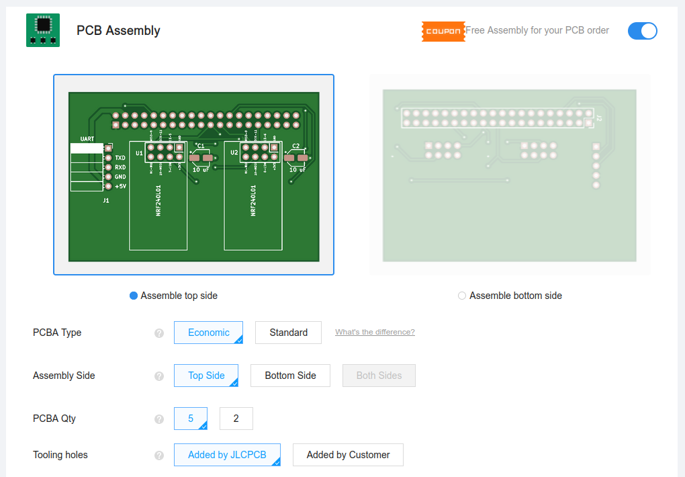

You can leave all the options as default, just make sure you are assembling on the top side. You could optionally enable "Confirm Parts Placement" if you want someone to give your board a lookover before assembling. Click the big "NEXT" button on the right side. It will prompt you to make an account (can just sign in with google).

10. In the next page, you will need to upload two files. 

- The first is the BOM (bill of materials) which contains the correspondence between reference designators (`C1` and `C2`) and the actual part JLCPCB number (`C3343`). This is located at `<project_directory>/jlcpcb/assembly/BOM-<project_name>.csv`.
- The second is the CPL (component placement list) which contains the X/Y coordinates of each reference designator. This is located at `<project_directory>/jlcpcb/assembly/POS-<project_name>.csv`. Note that the file is called POS for position, not CPL. Oh well.

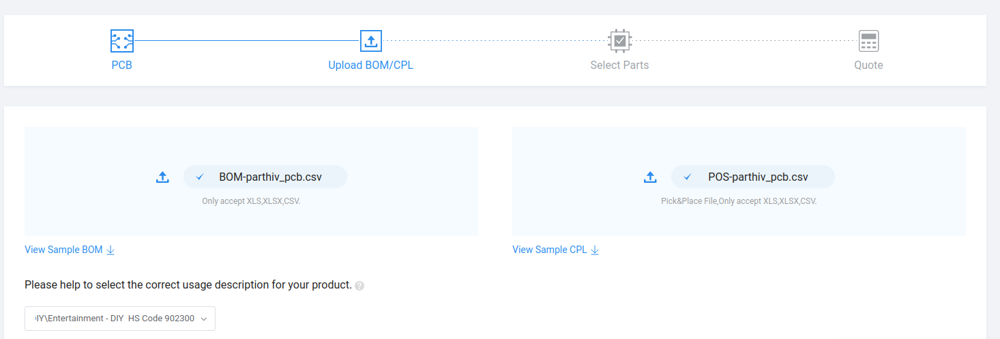

11. In the dropdown menu, select an appropriate usage description. I just do `Reserch\Education\DIY\Entertainment -> DIY HS Code 902300` (spelling errors are theirs not mine). Then hit `NEXT`. 

12. On the next page, validate that the correct part was detected. You can click the "Matched Part Detail" and verify.

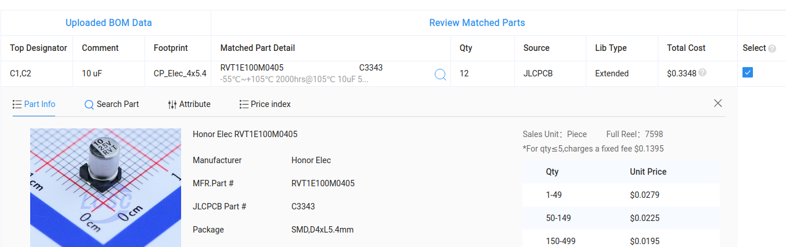

Hit "NEXT".

13. You will get a 3D view, similar to the KiCAD 3D viewer. However, this time it just shows the board and the 2 capacitors that JLCPCB will assemble. Ensure that they are in the correct spot. 

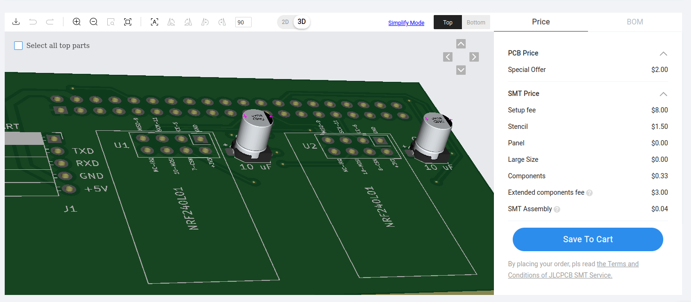

14. Click "Save To Cart". You're done and can order! It would take ~1 week to arrive.
