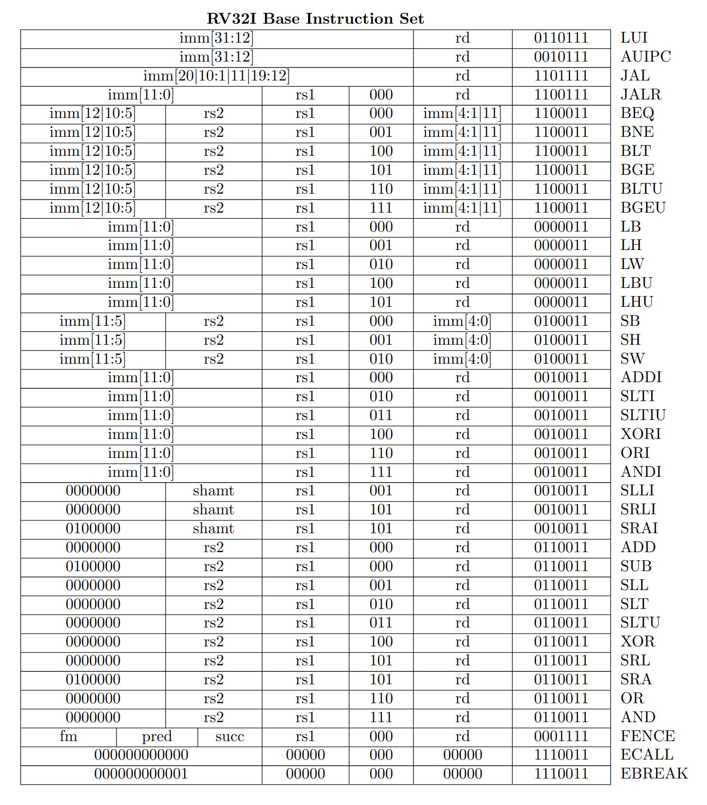
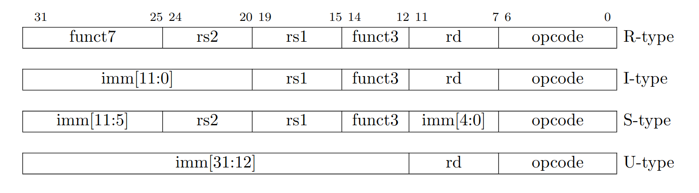
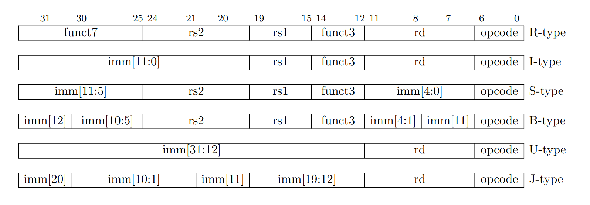
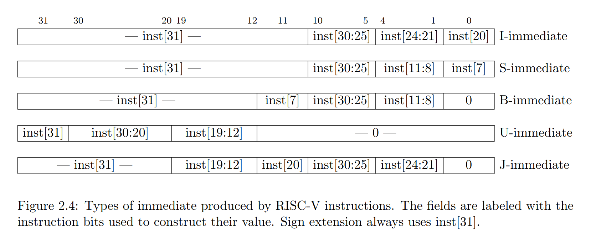

# Tiny RISC-V simulator

Today we are going to write a small RISC-V simulator.

First download a RISC-V GNU toolchain from
[here](https://github.com/zyedidia/riscv-gnu-toolchain-prebuilt/releases/tag/v1)
so that you can compile the test programs.

We'll be implementing the base 32-bit instruction set, called `rv32i` (the base
integer instruction set). RISC-V is a modular instruction set, with many
extensions that add more functionality. For example the M-extension adds
support for multiplication and division instructions. The base ISA plus the
M-extension would be called `rv32im`.

You should familiarize yourself with the base instruction set by reading through
the [ISA manual](https://www.scs.stanford.edu/~zyedidia/docs/riscv-spec.pdf).

Here is the full list of instructions we'll be implementing:

In particular, read the section on the rv32i base integer instruction set. At
the end of the manual there are also some helpful sections: "RV32/RV64
Instruction Set Listings" and "RISC-V Assembly Programmer's Handbook".

## Helpful tips about RISC-V

RISC-V has 32 registers, each storing 32 bits (in rv32). The zero register
(index 0) always stores zero and cannot be modified.

Each RISC-V instruction is 32-bits (because we aren't supporting the
C-extension for instruction compression), and a full list of the instruction
encodings is given in the manual in the instruction set listings section. There
are four different types of instruction encodings:

Each encoding has an opcode, specifying the particular type of instruction, and
possibly an additional funct3/funct7 code, providing further identification.
Instructions can also refer to one of the 32 registers, in the `rd`, `rs1`, or
`rs2` fields. `rs1` and `rs2` are arguments for the instruction, and `rd` is
the register the instructions writes the result to (if it writes a result).
Some instructions refer to an immediate, which is a constant encoded directly
into the instruction.

Each instruction has a 7-bit opcode which can be used to differentiate between
the different types of instructions in RISC-V. These are:

* R-type arithmetic instructions, which perform `rd = rs1 <op> rs2`.
* I-type arithmetic instructions, which perform `rd = rs1 <op> imm` (operating
  on an immediate value encoded directly into the instruction).
* Branch instructions, which perform `pc = pc + imm` if `cond(rs1, rs2)` is
  true. Conditions perform comparisons like less than, or equals.
* Load instructions, which perform `rd = mem[imm + rs1]`. There are several
  kinds loads for different sizes: `lb`, `lbu`, (load 8-bit values, `u`
  indicates no sign-extension) `lh`, `lhu`, (load 16-bit values) `lw` (load
  32-bit values).
* Store instructions, which perform `mem[imm + rs1] = rs2`. Also differently
  sized stores: `sb`, `sh`, `sw`.
* `jal` (unconditional jump), which performs `rd = pc + 4` and `pc = pc + imm`.
* `jalr` (unconditional jump to register), which performs `rd = pc + 4` and `pc = pc + rs1`.
* `lui` (load upper immediate), which performs `rd = imm`.
* `auipc` (load offset from pc), which performs `rd = pc + imm`.
* Fences and environment calls (don't worry about these for today).

Many kinds of instructions use immediate values that are encoded directly into
the instruction. Since instructions are 32 bits, clearly the immediate cannot
be a full 32-bit value. This restricts the range of immediates that can be
encoded, which for example restricts the range of locations a `jal` instruction
can jump to. Since we want to be able to encode immediates that are as large as
possible, there are several different immediate encodings listed in section 2.3
of the manual:

Here are the same encodings, but reformulated so that it shows how the
immediate is constructed from the bits of the instruction, rather than how the
immediate is encoded into the instruction.

## Writing the simulator

Run `knit` from the lab directory. This should build the basic `rvsim`, which
has support for executing `nop` instructions and `ebreak` (used to halt the
simulator). You can run the `nop` test with `knit test-nop`. Run with `knit
test-nop dump=1` to dump registers and memory after the simulation completes.
Run `knit check` to run the automated tests (should pass nop, but fail for
arith and everything else). `knit check` will check your register/memory dump
against the expected one.

Now implement the following parts:

### Part 1: U-type instructions

* Start the `extract_imm` function by implementing the U-type immediate
  decoder. This is a function involving a lot of bit manipulation. You can use
  the helper functions in `bits.h` (in particular `bits_remap` might be
  helpful).
* Implement `lui` and `auipc`.
* Implement opcode decoding in `machine_exec` (check the opcode and dispatch to
  the appropriate function).
* You should now pass the `utype` test.

### Part 2: arithmetic instructions

* Implement I-type immediate encoding.
* Implement `rarith` and `irarith` (and use `alu_compute` to do so).
* You should now pass the `arith` test.

### Part 3: loads and stores

* Implement the S-type immediate encoding.
* Implement `load` and `store`. You should use the machine's memory, and
  `mem_readX` and `mem_writeX` to read/write the memory.
* You should now pass the `itype` test.

### Part 4: jumps and branches

* Implement J-type and B-type immediate encodings.
* Implement the `jalr` instruction and `branch`.
* You should now pass the `jmp` test.
* You are now done and should be able to run the `hello` and `fib` binaries,
  which use some simulated system calls in `syscall.c` to run C programs that
  even call `printf`!.
