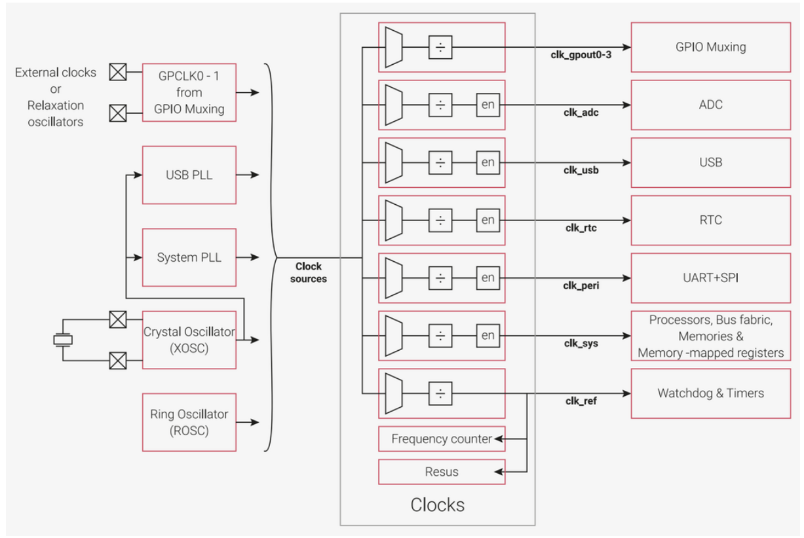
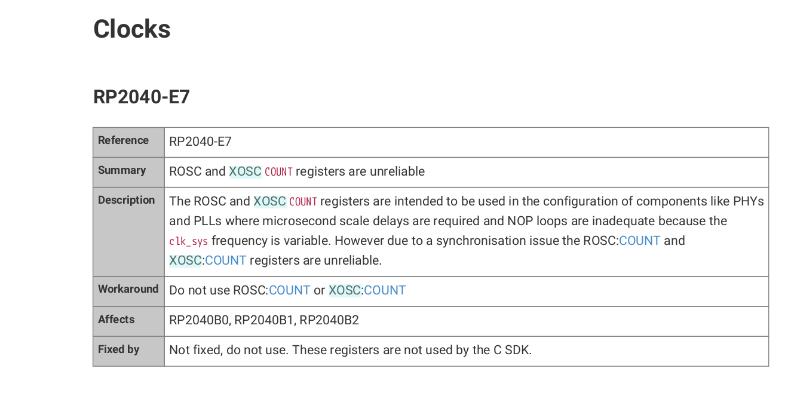

# Pico Pre-Lab
In addition to getting the Pico up and running I decided to tryout a new build system. I'm personally tired of looking at Makefiles whose syntax is nightmare. I don't want to have to remember the difference between '$@' and '$^'. So for this lab we will be using a new alternative called [https://mesonbuild.com/](Meson). From my research it seems to be a popular alternative that has a growing community. Meson is a build system thats built on top of a smaller build system called [https://ninja-build.org/](ninja). Ninja isn't the most beginner friendly but Meson does a great job at smoothing the learning curve. Most of the prelab is just installation so email me if you have any questions. We can also cover this during lab if you get stuck.

---

## Install Meson
   You can use this [https://mesonbuild.com/Quick-guide.html](guide) for installing Meson. You will notice this during the lab but Meson is basically the python equivalent of build systems. It shares a lot of the same syntax as python and includes a lot of helpful functions for creating executables in just a few lines. Once you've installed Meson you should be able to run `'meson -v'` to get a version number.

---

## Create Your Cross Compiler File
Meson makes it really easy to build files natively. However, things get a little more complicated when cross compiling. One of the first requirements is to create a cross compilation file. I've included a nearly complete file at `arm-cross-comp.txt`. All you have to do is figure out the path to your arm compiler. You can run `'whereis arm-none-eabi-gcc'` to find it and then copy that path into toolchain_folder. This file basically contains information that will be used across all our builds. For more information on where these sections come from you can look [https://mesonbuild.com/Cross-compilation.html](here). To avoid messing with environmental variables which are unfortunately a little annoying to read in Meson I created a path to your pico project folder. In this case copy the path to this lab and paste it in under proj_folder.

---

## Brief Overview of how Meson works
Some quick commands and rules that I have found are listed below. This might not be the best way to do things but I've found that it works.

1. In order to setup the build directory run `meson setup buildir --cross-file <name of cross file>`
2. If you every change the cross file or add a completely new file you must `rm -r buildir` and then rerun the command in step 1.
3. To actually run the code in your meson.build file you must `cd buildir` and run `meson compile`. This step can get a bit annoying so making a command that does all of the above for you might be nice.
4. Some directories should generate files for you to use. In order to generate these files you can run `meson install`.
---

## RP2040
If you want to understand where all the random values in my memmap come from you should checkout the RP2040 documentation. I've included some important sections in the list down below. Note: The GPIO registers for the pico work a little differently then A+

1. Section 2.8 (pg. 156) Bootrom
2. Section 2.1.2 (pg. 18) Writing to Peripherals
3. Section 2.3.1.7 (pg. 42) GPIO Registers
4. Section 2.15.2.2 XOSC Crystal Oscillator
5. Section 4.6 Timer 

 Time on the pico is tricky. The Pico has a lot of registers for setting up the system clock and the clock speed of individual peripherals. The image below gives a good general idea on whats happening with the system clock and the various sources it can have. The lab will quickly go over how to get access to time in the way that I believe is correct. Unfortunately it is not very accurate but I think theres just an errata somewhere that I can't seem to find. My other "janky" approach is included within the provided programs. It's not very pretty and I honestly just threw together a bunch of consistent values to make it work. The errate below proves that its not a great solution. I love how the data sheet says that the workaround is to just not use the registers instead of giving some other options for counting time.

