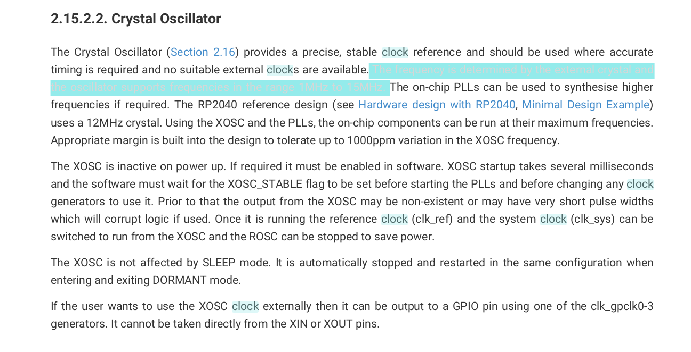
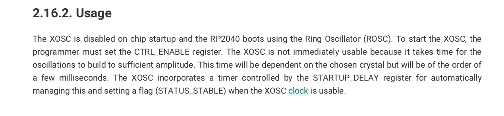
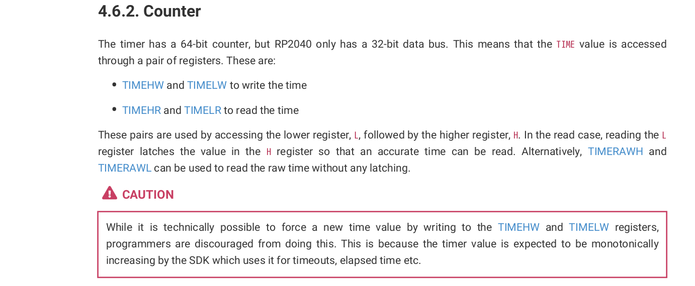

## 1-timer
This is the non janky way of counting time. I believe this is the intended way of getting time however it has some bugs. The first one is that it is not very accurate when checking microseconds. You can verify this with your A+ and your code from the logic analyzer. Secondly, you will notice that when you load from flash the pico will stop blinking. For some reason things get corrputed when loading from flash. With all that setaside I'll outline the steps for how I stumbled upon this source of time.

## Step 1
By default the pico boots off the ROSC oscillator which is not accurate at all. This is meant to save power and if you care about microsecond timing we need to use the XOSC crystal oscillator. Fill out the TODO's in clock.c to get the XOSC up and running. The following pages/images should be helpful.
1. Pg. 243 XOSC section 
2. Pg. 221 Clock Registers

Note: This solution is buggy. We're definitely getting 12MHZ based on some timing tests I did with the ROSC which runs at 6MHZ. However, were probably missing writing to some register when setting up the XOSC which is causing some sort of corruption. Feel free to ask me questions if you want to help me explore possible solutions. I have a couple ideas of what may be causing the error.