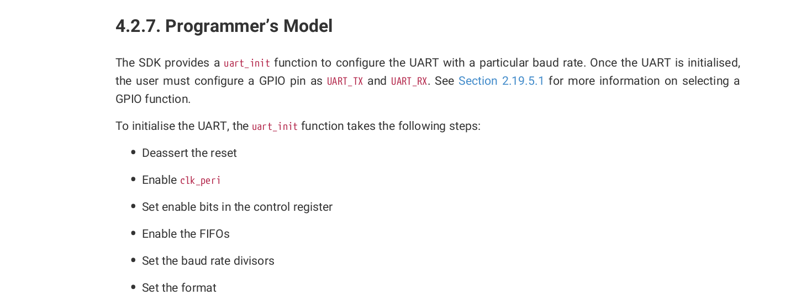
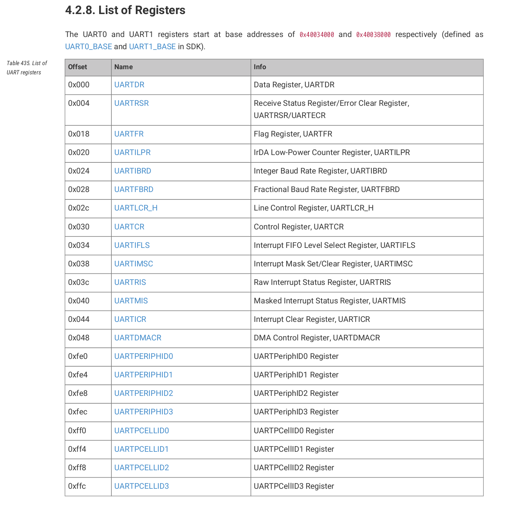

## Hardware UART

A huge up grade from the slow transmit speeds of our software uart. Here we rely on the hardware to take care of tranmission which makes me beleive that our clock setup is somewhat correct. The pico may not be great for bit banging protocols but at least we have some good hardware on it. I've listed out the steps you need to go through in order to finish this part of the lab and some images from the rp2040 datasheet that might be helpful.

1. Add gpio_set_function to your shared library and recompile your object files
2. Copy over clock.c from the previous program.
3. Enter uart.c and follow the instruction for setting up the hardware uart

